# Anatomi CSS 
```css
 p {
     color: red;
   }
```
1. Selektor: `p` - Ini menentukan bahwa rule ini akan digunakan untuk semua elemen `<p>` pada halaman HTML.
2. Property: `color` - Ini [menentukan properti yang akan diubah oleh rule ini. Dalam hal ini, properti yang diubah adalah warna teks.
3. Value: `red` - Ini menentukan nilai dari properti yang akan digunakan. Dalam hal ini, nilai properti "color" adalah "red", yang berarti teks akan menjadi merah.

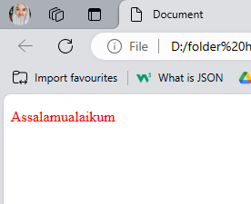
# Percobaan Pertama
## Kode CSS
```html
<!DOCTYPE html>
<html lang="en">
<head>
    <title>Document</title>
<style>
        P {
            color: red;
        }
</style>
</head>
<body>
    <p> welcome css! </p>
    <p> welcome css!</p>
</body>
</html>
```

## Before
![first][ASSET/first.png]
## After
![SEKEN][ASSET/seken.png]
>[! Penjelasan]-
>> kode CSS ditempatkan di dalam tag `<style>` yang berisi rule CSS untuk mengubah warna teks pada semua elemen `<p>` menjadi merah. Kemudian, kode HTML berisi dua elemen `<p>` dengan teks "welcome css!".
# Percobaan Kedua
## Font-size
### Kode CSS
```CSS
button {
            width: 150px;
            height: 50px;
            font-size: 10PX;
        }
```

### Before


### After


>[! penjelasan]-
>> font-size adalah untuk mengatur ukuran font pada property value yang ingin di eksekusi

## Color
### Kode CSS
```css
  button {
            width: 150px;
            height: 50px;
            font-size: 10PX;
            color: brown;
        }
```
### Before
        
### After


>[! penjelasan]-
>> color adalah
# Cara pemanggilan CSS
1. **External Metode:** Ini merupakan cara paling umum untuk menggunakan CSS. Dalam external metode, Anda menuliskan seluruh kode CSS dalam file CSS terpisah, dan memanggilnya di dalam file HTML menggunakan tag `<link>` di dalam tag `<head>` HTML.
Contoh :
```html
<head>
  <link rel="stylesheet" href="style.css">
</head>
<body>
  <p>welcome css!</p>
</body>
```

2. **Internal Metode:** Pada internal metode, Anda menuliskan kode CSS di dalam tag `<style>` di dalam tag `<head>` halaman HTML.
Contoh : 
```html
<head>
  <style>
    p {
      color: red;
    }
  </style>
</head>
<body>
  <p>welcome css!</p>
</body>
```

3. **inline Metode:** Pada inline metode, Anda menuliskan atribut `style` langsung di dalam tag HTML.
Contoh : 
```html
<p style="color: red;">welcome css!</p>
```
# Selector
1. **Element Selector:** Elemen selector digunakan untuk mengidentifikasi elemen HTML yang akan diubah, dengan cara menggunakan nama elemen HTML itu sendiri.
```css
p {
  color: red;
}
```
2. **Class Selector:** Class selector digunakan untuk mengidentifikasi elemen HTML yang memiliki atribut `class` tertentu.
```css
.merah {
  color: red;
}
```
3. **ID Selector:** ID selector digunakan untuk mengidentifikasi elemen HTML yang memiliki atribut `id` tertentu.
```css
#hijau {
    color: green;
}
```
# TEXT
## Text align
### PENJELASAN
- text-align:left ; Text akan ditampilkan di sebelah kiri dokumen.
- text-align:right ; Text akan ditampilkan di sebelah kanan dokumen.
-  text-align:center ; Text akan ditampilkan di tengah-tengah dokumen.
-  text-align:justify ; Text akan ditampilkan dengan mengikuti spasi yang ada di antara kata-kata.
### KODE PROGRAM
```css
css
p {
text-align: center;
}
```

### HASIL
#### BEFORE
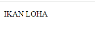
#### AFTER

### KESIMPULAN
dari kode program yang diberikan p { text-align: center; } adalah bahwa kode ini mengatur properti CSS text-align untuk elemen `<p>` (paragraf) dalam sebuah dokumen HTML. Dengan nilai center, semua teks dalam elemen `<p> `akan diatur ke tengah dari elemen tersebut.
## Text decoration
### PENJELASAN
- none : menghilangkan dekorasi garis pada teks (pilihan default).
- underline : menambahkan garis bawah pada teks.
- overline : menambahkan garis atas pada teks.
- line-through : menambahkan garis horizontal yang menembus tengah teks, sehingga tampak tercoret.
### KODE PROGRAM
```css
p {
text-decoration: line-through;
}
```

### HASIL
#### BEFORE

#### AFTER
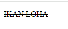
### KESIMPULAN
Kesimpulan text-decoration: line-through; adalah bahwa teks yang diberi gaya dengan properti ini akan memiliki garis melintang di tengahnya, menunjukkan bahwa teks tersebut dianggap tidak relevan, usang, atau tidak berlaku lagi.
## Text transform
### PENJELASAN
- none (default): Menjaga kapitalisasi teks seperti pada penulisan aslinya.
- uppercase: Mengubah semua huruf menjadi huruf besar (uppercase).
- lowercase: Mengubah semua huruf menjadi huruf kecil (lowercase).
- capitalize: Mengubah huruf pertama setiap kata menjadi huruf besar (capitalize), mirip gaya penulisan judul.
### KODE PROGRAM
```css
p {
text-transform: uppercase;
}
```
### HASIL
#### BEFORE
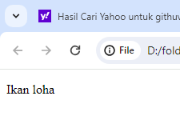
#### AFTER

### KESIMPULAN
Kesimpulan dari text-transform: uppercase; adalah bahwa teks yang diberi gaya dengan properti ini akan diubah menjadi huruf kapital semua.
## Text indent
### PENJELASAN
Text indent atau indentasi teks adalah proses membuat jarak antara teks dengan margin atas dari sebuah paragraf. Ini dapat membuat teks terlihat lebih rapi dan terstruktur. Teks dapat diatur dengan menggunakan tanda indentasi seperti tab atau spasi.
### KODE PROGRAM
```css
p {
text-indent: 100px
}
```

### HASIL
#### BEFORE
![[CSS/ASSET/s4.png]]
#### AFTER
![[Pasted image 20240615113957.png]]
### KESIMPULAN
Kesimpulan dari penggunaan properti CSS text-indent: 100px; adalah bahwa paragraf (elemen `<p>`) akan memiliki indentasi teks sebesar 100 piksel dari sisi kiri. ini digunakan untuk mengatur jarak atau spasi antara tepi kiri elemen paragraf dan teks di dalamnya.
## Letter spacing
### PENJELASAN
Letter spacing merujuk pada jarak horizontal antara huruf-huruf dalam sebuah teks. kata lain, letter spacing mengontrol seberapa dekat atau berjauhan huruf-huruf tersebut ditempatkan satu sama lain.
### KODE PROGRAM
```css
p {
letter-spacing: 50px;
}
```

### HASIL
#### BEFORE

#### AFTER
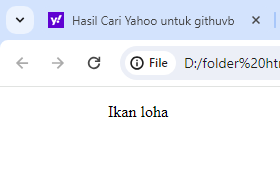
### KESIMPULAN
Kesimpulan dari penggunaan properti CSS letter-spacing: 50px; adalah bahwa jarak antara setiap huruf dalam teks pada elemen `<p>` akan diperbesar sebesar 50 piksel. ini digunakan untuk mengatur spasi horizontal antara huruf-huruf dalam teks, menciptakan efek visual seperti peningkatan jarak antara huruf-huruf atau tampilan teks yang lebih terbaca dengan jelas.
## Line height
### PENJELASAN
Line height adalah properti dalam CSS yang menentukan *jarak vertikal* antara baris teks dalam sebuah elemen, biasanya elemen paragraf (`<p>`).
### KODE PROGRAM
```css
p {
line-height: 150px;
}
```

### HASIL
#### BEFORE

#### AFTER
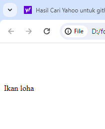
### ANALISIS
Kesimpulan "line-height" diatur menjadi 150 piksel untuk elemen "p". "line-height" digunakan untuk mengatur jarak antara baris dalam elemen teks. nilai "150px" menunjukkan bahwa jarak antara setiap baris dalam elemen "p" akan menjadi 150 piksel.
## Word spacing
### PENJELASAN
Word spacing merujuk pada pengaturan jarak antara kata dalam teks.
### KODE PROGRAM
```css
p {
word-spacing: 150px;
}
```

### HASIL
#### BEFORE

#### AFTER
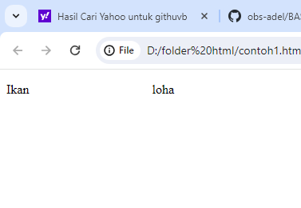
### ANALISIS
Kode word-spacing: 150px;, mengatur jarak antar kata dalam `<p>`elemen (paragraf) menjadi 150 piksel. Ini berarti akan ada jarak yang cukup besar antara setiap kata dalam paragraf, sehingga menciptakan tampilan visual yang berbeda. Properti ini dapat digunakan untuk berbagai tujuan desain, seperti membuat tata letak yang unik atau menekankan kata-kata individual.

# BACKGROUND
## Penjelasan
Properti dalam CSS digunakan untuk mengatur latar belakang suatu elemen. Ini dapat digunakan untuk mengatur warna latar belakang, gambar, pola ulang, dan atribut latar belakang lainnya.
1. `background-color` : Properti ini digunakan untuk mengatur warna latar belakang suatu elemen. Ini dapat diatur ke nama warna, kode warna heksadesimal, atau nilai RGB.
2. `background-repeat` : Properti ini digunakan untuk mengatur apakah gambar latar belakang harus diulang atau tidak. Ini dapat diatur untuk mengulangi, tidak-mengulangi, mengulangi-x, atau mengulangi-y.
3. `background-image` : Properti ini digunakan untuk mengatur gambar sebagai latar belakang elemen. Itu dapat diatur ke URL file gambar.
4. `background-position` : Properti ini digunakan untuk mengatur posisi gambar latar belakang.
## Kode Program
```css
background-color: red;
```
## Hasil
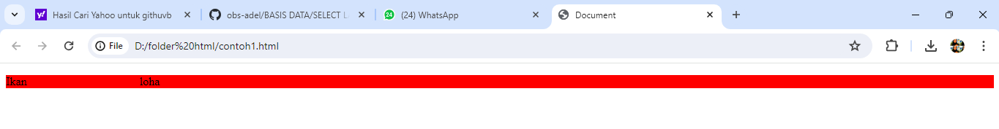
### Kesimpulan
`background-color` digunakan untuk mengatur warna latar belakang elemen, dan dapat diatur menggunakan berbagai nilai.

# BOX-MODEL
## PADDING
### Penjelasan
`padding` adalah sebuah properti CSS yang digunakan untuk menentukan jarak antara konten elemen dan garis batas elemen tersebut. Properti `padding` dapat diatur pada semua direksi, yaitu atas, bawah, kiri, dan kanan. Untuk mengatur `padding` pada direksi tertentu, gunakan properti `padding-top`, `padding-bottom`, `padding-left`, dan `padding-right`.
1. `padding-top`: Properti ini digunakan untuk menentukan jarak antara konten elemen dan garis atas elemen tersebut.
2. `padding-bottom`: Properti ini digunakan untuk menentukan jarak antara konten elemen dan garis bawah elemen tersebut.
3. `padding-left`: Properti ini digunakan untuk menentukan jarak antara konten elemen dan garis kiri elemen tersebut.
4. `padding-right`: Properti ini digunakan untuk menentukan jarak antara konten elemen dan garis kanan elemen tersebut.
### Kode Program
```css
.button1 {
    background-color: pink;
    width: 100px;
    height: 50px;
   border: 5px solid palevioletred;
   border-radius: 10px 15px;
   padding-left: 0px;
   padding-bottom: 50px;
   padding-right: 50px;
   padding-top: 50px;
```
### Hasil
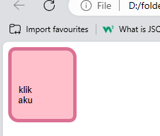
### Kesimpulan 
Properti `padding` adalah properti CSS yang digunakan untuk menentukan jarak antara konten elemen dan garis batas elemen tersebut.
## MARGIN
### Penjelasan
`margin` adalah properti CSS yang digunakan untuk menentukan jarak antara elemen dan elemen lainnya atau antara elemen dan area konten halaman. Properti `margin` dapat diatur pada semua direksi, yaitu atas, bawah, kiri, dan kanan. Untuk mengatur `padding` pada direksi tertentu, gunakan properti `margin-top`, `margin-bottom`, `margin-left`, dan `margin-right`.
1. `margin-top`: menetapkan margin atas elemen, yang merupakan spasi di atas elemen.
2. `margin-bottom`: menetapkan margin bawah elemen, yang merupakan spasi di bawah elemen.
3.  margin-left`: mengatur margin kiri elemen, yang merupakan spasi di sebelah kiri elemen.
4. `margin-right`: menetapkan margin kanan elemen, yang merupakan spasi di sebelah kanan elemen.

### Kode Program
```css
.button2 {
    background-color: pink;
    width: 100px;
    height: 50px;
    border: 0px;
    margin-top: 600x;
    margin-bottom: 600px;
    margin-left: 500px;
    margin-right: 100px;
}
```
### Hasil
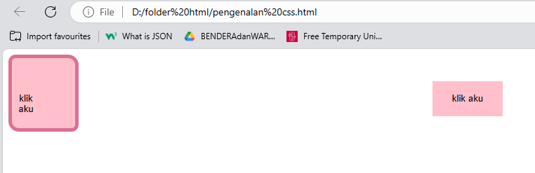

### Kesimpulan 
`margin` adalah properti singkatan untuk mengatur margin elemen di empat arah atas, kanan, bawah, dan kiri.

## BORDER
### Penjelasan
Properti dalam CSS digunakan untuk mengatur batas elemen.  
1. `border-width` : Properti ini digunakan untuk mengatur lebar perbatasan. dapat diatur ke nilai panjang, seperti piksel
2. `border-style` : Properti ini digunakan untuk mengatur gaya perbatasan. dapat diatur ke nilai seperti solid, putus-putus, putus-putus, atau tidak ada.
3. `border-color` : Properti ini digunakan untuk mengatur warna perbatasan. dapat diatur ke nama warna, kode warna heksadesimal
### Kode Program
```css
button {
    border-color: violet;
    border-width: 15000px;
    border-style: initial;
}
```
### Hasil
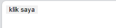
### Kesimpulan 
Properti menetapkan warna perbatasan menjadi ungu. Properti menetapkan lebar batas ke 15000px. Namun, nilai ini biasanya jauh lebih besar dari yang diperlukan dan mungkin tidak praktis secara visual.`border-color``border-width`    
# LATIHAN BOX-MODEL
### Penjelasan 
1. `p { ... }`: Ini adalah pemilih elemen yang mengatur tata letak dan gaya teks pada halaman web. Dalam kode ini, properti dan nilai yang digunakan adalah :
- f`ont-size: 75px;` -> Mengatur ukuran font menjadi 75 piksel.
- `font-family: 'arial';` -> Mengatur jenis font menjadi Arial.
- `margin-top: 150px;` -> Mengatur jarak antara teks dan elemen di atasnya menjadi 150 piksel.
- `margin-bottom: 100px;` -> Mengatur jarak antara teks dan elemen di bawahnya menjadi 100 piksel.
- `margin-left: 50px;` -> Mengatur jarak antara teks dan elemen di sebelah kiri menjadi 50 piksel.
- `margin-right: 100px;` -> Mengatur jarak antara teks dan elemen di sebelah kanan menjadi 100 piksel.
- `color: aliceblue;` -> Mengatur warna teks menjadi aliceblue.

2. `img { ... }`: Ini adalah pemilih elemen gambar pada halaman web. Dalam kode ini, properti dan nilai yang digunakan adalah:
- `margin-right: 200px;` -> Mengatur jarak antara gambar dan elemen di sebelah kanan menjadi 200 piksel.
- `margin-top: -30px;` -> Mengatur jarak antara gambar dan elemen di atasnya menjadi -30 piksel (agar gambar terlihat lebih bawah).
- `border: 10px solid white;` -> Mengatur border gamb  ar menjadi 10 piksel dengan warna putih.
- `border-radius: 1500px 1500px;` -> Mengatur sudut pada border gambar menjadi bulat.
  
3. `button { ... }`: Ini adalah pemilih elemen tombol pada halaman web. Dalam kode ini, properti dan nilai yang digunakan adalah:
- `background-color: purple;` -> Mengatur warna latar belakang tombol menjadi ungu.
- `width: 150px;` -> Mengatur lebar tombol menjadi 150 piksel.
- `height: 50px;` -> Mengatur tinggi tombol menjadi 50 piksel.
- `border-width: 2px;` -> Mengatur lebar border tombol menjadi 2 piksel.    
- `color: orange;` -> Mengatur warna teks tombol menjadi orange.
- `border-color: orange;` -> Mengatur warna border tombol menjadi orange.    
- `margin-bottom: 20px;` -> Mengatur jarak antara tombol dan elemen di bawahnya menjadi 20 piksel.
- `margin-left: 390px;` -> Mengatur jarak antara tombol dan elemen di sebelah kiri menjadi 390 piksel
### Kode Program
```html
<!DOCTYPE html>
<html lang="en">
<head>
    <title> LATIHAN </title>
    <link rel="stylesheet" href="latihan1.css">
</head>
<body bgcolor="purple">
    <span>
        
        <p> Selamat Datang <br><b>
                di web adel !</b>
        <p>
    </span>
    <button> klik saya </button>
</body>
</html>
```

```css
p {
    font-size: 75px; 
    font-family: 'arial';
    margin-top: 150px;
    margin-bottom: 100px;
    margin-left: 50px;
    margin-right: 100px;  
    color: aliceblue;
}
img {
    margin-right: 200px;
    margin-top: -30px;  
    border: 10px solid white;
    border-radius: 1500px 1500px;
}
button {
    background-color: purple;
    width: 150px;   
    height: 50px;
    border-width: 2px;
    color: orange;
    border-color: orange;
    margin-bottom: 20px;
    margin-left: 390px;  
}
```
### Hasil
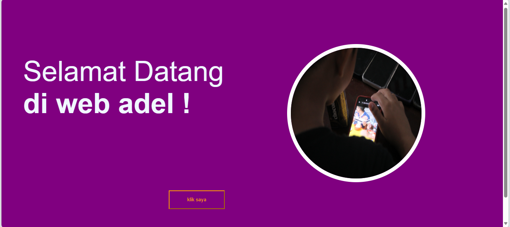
### Kesimpulan  

# Transition
## Penjelasan
1.  `Transition-property` : atribut yang digunakan untuk transisi yang apabila kursor didekatkan maka transisi akan berfungsi.
2. `Transition-duration` : Properti ini `transition-duration`menentukan berapa detik (s) atau milidetik (ms) yang diperlukan untuk menyelesaikan efek transisi.
3. `Transition-timing function` : Properti `transition-timing-function`menentukan kurva kecepatan efek transisi. Properti ini memungkinkan efek transisi untuk mengubah kecepatan sepanjang durasinya
## Kode program
```css
div {
  width: 100px;
  height: 100px;
  background: blueviolet;
  transition: width 2s;
  transition-timing-function: linear;
}
div:hover {
  width: 300px;
}
```
## Hasil
### Before

### After

## Kesimpulan
Kesimpulannya, properti-properti transisi seperti `transition-property`, `transition-duration`, dan `transition-timing-function` digunakan bersama-sama untuk mengontrol efek transisi pada elemen-elemen di halaman web.
# Transform
`Transform` adalah untuk mengubah tampilan elemen HTML, seperti menggeser, memutar, atau mengubah ukurannya ketika di klik. Ini adalah cara untuk membuat animasi sederhana atau mengatur posisi elemen dengan lebih fleksibel, atau lebih singkatnya mengubah gaya pada suatu elemen HTML ketika diklik.
## Penjelasan
Fungsi mengubah ukuran elemen, dan nilainya berarti elemen tersebut akan diskalakan ke ukuran aslinya. Jadi, kode tidak akan mengubah tampilan visual elemen.`transform: scale(1.0)``scale()``1.0``transform: scale(1.0)`
## Kode Program
```css
.box-item-1:hover {
    transform: scale(1.0);
```
## Hasil
### Before

### After

# FLEX-BLOX
## FLEX-CONTAINER
### Penjelasan
Flex container adalah elemen induk yang mengatur tata letak flex item-nya. flexbox yaitu memberikan container kemampuan untuk mengatur panjang, lebar, dan posisi item-item yang berada di dalamnya agar memaksimalkan ruang yang ada. Pengaturan ini sangat penting bagi seorang frontend developer untuk membuat sebuah website yang nyaman dilihat di berbagai device dengan berbagai macam resolus.
1. `flex-direction` :Menentukkan arah (direction) yang akan diberlakukan untuk item-item yang ada pada container flexbox.
2. `flex-wrap` :Digunakan untuk mendefinisikan bahwa elemen item di dalam container flexbox tidak harus disejajarkan dalam satu baris.
3. `justify-content` :Digunakan untuk mensejajarkan item-item diantara flexbox agar container dari flexbox tersebut bisa mendistribusikan ruang kosong yang tersisa ketika item flex dalam satu baris tersebut tidak flexsibel atau meskipun flexsibel tapi sudah mencapai batas ukuran maksimum.
4. `align-items` :Mendefinisikan bagaimana item-item pada container flex tersebut diletakkan sepanjang garis tegak lurus pada sumbu utama (cross-axis).
5. `align-content` :Digunakan untuk mensejajarkan garis flex container ketika ada ruang kosong secara garis tegak lurus pada sumbu utama (cross-axis).
### Kode Program

```css
.contrainer {
    display: flex;
    height: 100vh;
    justify-content: space-around ;
    align-items: center  ;
    background-color: blanchedalmond;
}
```
### Hasil
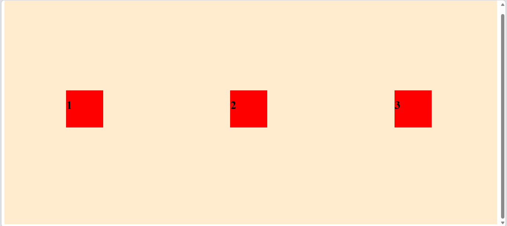
## FLEX-ITEM
### Penjelasan
 Dalam konteks Flexbox, elemen-elemen dianggap sebagai flex items (item fleksibel), dan mereka diatur dalam satu dimensi (baris atau kolom) menggunakan properti-properti Flexbox.
 1. `flex-grow`: Properti ini menentukan sejauh mana flex item akan memperluas ruang tersedia dalam flex container.
 2. `flex-shrink`: Properti ini menentukan sejauh mana flex item akan menyusut jika ruang tidak cukup dalam flex container.
 3. `flex-basis`: Properti ini menentukan ukuran awal (basis) flex item sebelum fleks container membagi ruang yang tersedia.
 4. `flex`: Properti singkat `flex` digunakan untuk menggabungkan `flex-grow`, `flex-shrink`, dan `flex-basis` dalam satu deklarasi.
### Kode Program
```css
.item {
    width: 100px;
    margin-right: 10px;
    margin-bottom: 10px;
    height: 100px;
    background-color: red;
    display: flex;
}
```
### Hasil 

### Kesimpulan
Kesimpulannya, dalam CSS Flexbox, elemen-elemen dianggap sebagai flex items (item fleksibel) dan dapat diatur menggunakan properti-properti Flexbox.
# PSEUDO-CLASS
## Hover
### Penjelasan
Digunakan untuk mengganti tampilan elemen saat kursor mouse berada di atasnya. Ini sering digunakan untuk efek hover seperti perubahan warna latar belakang atau tampilan teks yang berubah.
## Kode Program
```CSS
<!DOCTYPE html>
<html>
<head>
<style>
a:hover {
  background-color: yellow;
}
</style>
</head>
<body>
<h1>Contoh hover</h1>
<p>Nayah comel</p>
<a href="https://www.wikipedia.org">wikipedia.org</a>
</body>
</html>
```
### Hasil
![hover][ASSET/hover.jpeg]

## Active
### Penjelasan 
Digunakan untuk mengganti tampilan elemen saat elemen tersebut sedang aktif atau ditekan, seperti tombol yang sedang ditekan.
### Kode Program
```CSS
<!DOCTYPE html>
<html>
<head>
<style>
a:active {
  background-color: yellow;
}
</style>
</head>
<body>
<h1>Contoh Active</h1>
<a href="https://www.smk7mks.com">SMK 7</a><br>
</body>
</html>
```
### Hasil
![ACTIVE][ASSET/active.jpeg]

## Visited
### Penjelasan
digunakan untuk memilih tautan yang dikunjungi
###  Kode Program
```css
<!DOCTYPE html>
<html>
<head>
<style>
a:visited {
  color: pink;
}
</style>
</head>
<body>
<h1>Contoh Visited</h1>
<a href="https://www.smk7mks.com">smk7</a><br>
</body>
</html>
```
### Hasil
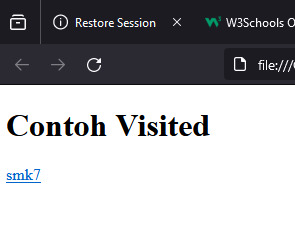
# POSITION
## Position relative
### Penjelasan
`position:` relative adalah properti CSS yang digunakan untuk menetapkan posisi elemen pada halaman web relatif terhadap posisinya sendiri.
### Kode program
```Css
.box { position: relative; top: 10px; left: 10px; width: 100px; height: 100px; background-color: red; }
``` 
### Hasil
![relative][ASSET/relative.png]
### Kesimpulan
memungkinkan pengguna untuk mengatur posisi elemen dengan properti top, right, bottom, atau left
## Position absolute
### Penjelasan
`position`: absolute akan dikeluarkan dari normal flow, yang berarti elemen tersebut tidak akan memengaruhi posisi elemen lain di halaman.
### Kode program
```css
.box { position: absolute; top: 10px; left: 10px; width: 100px; height: 100px; background-color: red; }
```
### Hasil
![absolute][ASSET/absolute.png]

### Kesimpulan
 hanya berpengaruh pada elemen yang diatur, tidak akan berpengaruh pada posisi elemen lain.
## Position fixed
### Penjelasan
`position`: `fixed` adalah properti CSS yang digunakan untuk menetapkan posisi elemen pada halaman web tetap dalam posisi tertentu di layar
### Kode program
```CSS
.box {
  position: fixed;
  width: 100px;
  height: 100px;
  background-color: red;
}
```
### Hasil
![sfixed][ASSET/fixed.png]

### Kesimpulan
Untuk menetapkan posisi suatu elemen
## Position sticky
### Penjelasan
Posisi sticky adalah cara efektif untuk mengubah posisi elemen dengan kecil atau sedikit, seperti menyesuaikan posisi elemen dengan kursor atau mengubah posisi elemen dalam layout. 
### Kode program
```CSS
.box {
  position: sticky;
  top: 10px;
  width: 100px;
  height: 100px;
  background-color: red;
}
```

### Hasil
![sticky][ASSET/sticky.png]
### Kesimpulan
`position`: sticky akan bergulir seperti normal hingga mencapai titik tertentu

# TANTANGAN FLEXBLOX
## Penjelasan
1. `<!DOCTYPE html>`: Ini adalah deklarasi tipe dokumen HTML yang menunjukkan bahwa dokumen ini adalah dokumen HTML5.
2. `<html lang="en">`: Ini adalah elemen root (akar) dari dokumen HTML. `lang="en"` menunjukkan bahwa bahasa yang digunakan dalam dokumen adalah bahasa Inggris.
3. `<head>`: Elemen `<head>` digunakan untuk menyediakan informasi tentang dokumen, seperti judul (title) dan referensi ke file eksternal seperti stylesheet (CSS).
4. `<title>`: Elemen `<title>` digunakan untuk menentukan judul dokumen yang akan ditampilkan di bilah judul browser.
5. `<link rel="stylesheet" href="tugasflex.css">`: Elemen `<link>` digunakan untuk menghubungkan dokumen HTML dengan file eksternal CSS. Dalam contoh ini, file CSS yang disebut "tugasflex.css" akan digunakan untuk mengatur tampilan halaman.
6. `<body bgcolor="purple">`: Elemen `<body>` digunakan untuk mengelilingi konten utama halaman web. `bgcolor="purple"` adalah atribut yang digunakan untuk mengatur warna latar belakang body menjadi ungu (purple).
7. `<div class="main-container">`: Elemen `<div>` adalah elemen blok yang digunakan untuk mengelompokkan dan mengatur konten. `class="main-container"` adalah atribut kelas yang memberikan nama kelas "main-container" pada elemen ini. Kelas ini nantinya dapat digunakan dalam CSS untuk mengatur tampilan elemen ini.
8. `<div class="hero-container">`: Elemen `<div>` dengan kelas "hero-container" digunakan untuk mengelompokkan konten yang terkait dengan bagian hero atau bagian utama halaman.
9. `<div class="item p">`: Elemen `<div>` dengan kelas "item p" digunakan untuk mengelompokkan konten dan memberikan atribut kelas "p".
10. `<p>`: Elemen `<p>` digunakan untuk menampilkan paragraf teks. Di dalam elemen ini, terdapat teks "Selamat Datang" dan "di Web Adel" yang ditampilkan dalam beberapa baris yang dipisahkan oleh tag `<br>`. Teks "Web Adel" ditampilkan dengan teks tebal menggunakan tag `<b>`.
11. `<button>`: Elemen `<button>` digunakan untuk membuat tombol. Di sini, tombol ditampilkan dengan teks "klik saya".
12. `<span class="img">`: Elemen `<span>` digunakan untuk mengelompokkan dan memanipulasi bagian teks atau elemen lainnya dalam dokumen. Di sini, elemen span memiliki atribut kelas "img".
13. ``: Elemen `` digunakan untuk menampilkan gambar dalam halaman. Atribut `src` menentukan sumber gambar (dalam hal ini, "abrar.JPG"), sedangkan atribut `width` dan `height` mengatur lebar dan tinggi gambar. Atribut `align="right"` mengatur posisi gambar ke sebelah kanan.
## Kode Program
```html
<!DOCTYPE html>
<html lang="en">
<head>
    <title>Document</title>
    <link rel="stylesheet" href="tugasflex.css">
</head>
<body bgcolor="purple">
    <div class="main-container">
    <div class="hero-container">
        <div class="item p">
           <p> Selamat Datang <br>
            di <b>Web Adel</b> </P>
            <button> klik saya </button>
        </div>
        <div>
            <span class="img">
                
            </span>
    </div>
    </div>
</div>
</body>
</html>
```
## Hasil
![tantangan1][ASSET/tantangan1.png]
## Kesimpulan
Terdapat sebuah `<div>` dengan kelas "container" yang berperan sebagai wadah utama.
- Di dalam `<div>` tersebut terdapat dua elemen lainnya.
- Elemen pertama adalah sebuah gambar yang ditampilkan menggunakan tag  dengan kelas "box-1".
- Elemen kedua adalah sebuah teks yang ditampilkan menggunakan tag `<p>` dengan kelas "box-2".
- Ada pula sebuah tombol yang ditampilkan menggunakan tag `<button>` di luar div "container".
- Body memiliki latar belakang berwarna "bisque" dan lebar 100% dari viewport.
- Elemen dengan kelas "container" menggunakan properti display: contents; untuk mengubah perilaku tata letak dan mengabaikan elemen wadah tersebut dalam tata letak.
- Properti align-items: flex-end; mengatur elemen di dalam div "container" agar ditampilkan di bagian bawah.
- Properti flex-direction: row; mengatur tata letak elemen di dalam div "container" menjadi horizontal.
- Properti justify-content: space-around; mengatur ruang antara elemen di dalam div "container".
- Kelas "box-2" memiliki properti untuk mengatur ukuran font, margin, dan warna teks.
- Kelas "box-1" memiliki properti untuk mengatur margin, border, dan border radius sehingga menghasilkan bentuk lingkaran.
- Tombol memiliki properti tampilan yang kustom, seperti latar belakang, ukuran, warna teks, dan efek hover

# TANTANGAN POSITION
## Penjelasan
- `<html>`: Ini adalah elemen root (akar) dari halaman HTML.
- `<head>`: Ini adalah elemen yang berisi informasi tentang halaman web, seperti judul halaman dan tautan ke file eksternal seperti file CSS.
- `<title>`: Ini adalah elemen yang menentukan judul halaman web yang akan ditampilkan di tab browser.
- `<link rel="stylesheet" href="anu.css">`: Ini adalah elemen yang menautkan (link) file CSS eksternal dengan halaman HTML. File CSS yang ditautkan adalah "tantangan_position.css".
- `<body>`: Ini adalah elemen yang berisi semua konten yang akan ditampilkan di halaman web.
- `<div class="container">`: Ini adalah elemen div dengan kelas "container". Elemen ini digunakan sebagai wadah (container) untuk mengelompokkan konten lainnya.
- `<div class="box">`: Ini adalah elemen div dengan kelas "box". Elemen ini digunakan sebagai wadah untuk mengelompokkan konten-konten yang ada di dalamnya.
- ``: Ini adalah elemen gambar (img) dengan kelas "item" dan "box-1". Elemen ini menampilkan gambar dengan sumber (src) "bg.jpg" dan teks alternatif (alt) "Gambar".
- `<p>`: Ini adalah elemen paragraf (p). Ada beberapa elemen paragraf dalam kode tersebut.
- ``: Ini adalah elemen gambar (img) dengan kelas "icon". Elemen ini menampilkan gambar dengan sumber (src) "jempol.png".
- `<p class="item box-2">Saturday, April 27, 2024</p>`: Ini adalah elemen paragraf (p) dengan kelas "item" dan "box-2". Elemen ini menampilkan teks "Saturday, April 27, 2024".
- `<h1 class="item box-3">The standard chunk of <br>Lorem Ipsum</h1>`: Ini adalah elemen heading level 1 (h1) dengan kelas "item" dan "box-3". Elemen ini menampilkan teks "The standard chunk of" diikuti dengan baris baru (<br>) dan teks "Lorem Ipsum".
- `<p class="item box-4">Sed posuere consectetur est at lobortis.<br>Aeneen eu leo quam</p>`: Ini adalah elemen paragraf (p) dengan kelas "item" dan "box-4". Elemen ini menampilkan dua baris teks dengan menggunakan baris baru (<br>).
- `<p class="box-5"><b>Read more </b> </p>`: Ini adalah elemen paragraf (p) dengan kelas "box-5". Elemen ini menampilkan teks "Read more" yang ditebalkan `(<b>)` diikuti dengan elemen gambar (img) dengan kelas "item-1" dan sumber (src) "icon.png".

## Kode Program
```HTML
<!DOCTYPE html>
<html>
<head>
    <title>POSITION</title>
    <link rel= "stylesheet" href="anu.css">
</head>
<body>
    <div class="container">
        <div class="box"> 
            
            <p> </p>
            <p class="item box-2">Saturday, April 27, 2024</p>
            <h1 class="item box-3">The standard chunk of <br>Lorem Ipsum</h1>
            <p class="item box-4">Sed posuere consectetur est at lobortis.<br>Aeneen eu leo quam</p>
            <p class="box-5"><b>Read more </b> </p>
        </div>
    </div>
</body>
</html>
```

```CSS
.container {
    position: static;
    display: flex;
    flex-direction: column;
    width: 100%;
    height: 580px;
    background-color: rgba(122, 122, 247, 0.628);
}
.box {
    width: 250px;
    height: 350px;
    background-color: white;
    align-items: center;
    align-content: center;
    border-radius: 10px;
    align-self: center;o8
    margin-top: 150px;
    margin-bottom: 200px;
}

.item {
    width: 100%;
    color: black;
}

.box-1 {
    height: 225px;
    width: 100%;
    border-radius: 10px 10px 0px 0px;
    
}

.box-2 {
    font-size: 10px;
    margin-left: 20px;
    margin-top: 20px;
    padding-top: 10px;
    font-family: Arial, Helvetica, sans-serif;
}

.box-3 {
    font-size: 18px;
    margin-left: 20px;
    margin-top: 10px;
    padding-top: 10px;
    font-family: Arial, Helvetica, sans-serif;
}

.box-4 {
    font-size: 11px;
    font-family: Arial, Helvetica, sans-serif;
    margin-left: 20px;
}

.box-5 {
    background-color: rgb(193, 193, 193);
    padding-left: 20px;
    padding-bottom: 10px;
    padding-top: 10px;
    margin-bottom: 90px ;
    font-family: Arial, Helvetica, sans-serif;
    border-radius: 0px 0px 10px 10px;
    font-size: small;
}

.item-1 {
    width: 10px;
    padding-left: 130px;
}

.icon {
   background-color: skyblue;
   position: relative;
   left: 200px;
   bottom: 35px;
   width: 30px;
   height: 30px;
   border-radius: 1500px;
}
```

## Hasil
![positions][ASSET/positions.jpeg]
## Kesimpulan
Kesimpulan dari kode HTML yang Anda berikan adalah sebagai berikut:

- Kode HTML ini merupakan struktur dasar dari sebuah halaman web.
- `<DOCTYPE html>` digunakan untuk menentukan jenis dokumen HTML yang digunakan, yaitu HTML5.
- `<html>` adalah elemen root (akar) dari halaman HTML.
- `<head>` berisi informasi tentang halaman web, seperti judul halaman dan tautan ke file eksternal seperti file CSS.
- `<title>` digunakan untuk menentukan judul halaman web yang akan ditampilkan di tab browser.
- `<link rel="stylesheet" href="anu.css">` adalah elemen yang menautkan (link) file CSS eksternal dengan halaman HTML. File CSS yang ditautkan adalah "anu.css".
- `<body>` berisi semua konten yang akan ditampilkan di halaman web.
- `<div class="container">` adalah elemen div dengan kelas "container". Elemen ini digunakan sebagai wadah (container) untuk mengelompokkan konten lainnya.
- `<div class="box">` adalah elemen div dengan kelas "box". Elemen ini digunakan sebagai wadah untuk mengelompokkan konten-konten yang ada di dalamnya.
- `` adalah elemen gambar (img) dengan kelas "item" dan "box-1". Elemen ini menampilkan gambar dengan sumber (src) "bg.jpg" dan teks alternatif (alt) "Gambar".
- `<p>` adalah elemen paragraf (p). Ada beberapa elemen paragraf dalam kode tersebut.
- `` adalah elemen gambar (img) dengan kelas "icon". Elemen ini menampilkan gambar dengan sumber (src) "jempol.png".
- `<p class="item box-2">Saturday, April 27, 2024</p>` adalah elemen paragraf (p) dengan kelas "item" dan "box-2". Elemen ini menampilkan teks "Saturday, April 27, 2024".
- `<h1 class="item box-3">The standard chunk of <br>Lorem Ipsum</h1>` adalah elemen heading level 1 (h1) dengan kelas "item" dan "box-3". Elemen ini menampilkan teks "The standard chunk of" diikuti dengan baris baru `(<br`) dan teks "Lorem Ipsum".
- `<p class="item box-4">Sed posuere consectetur est at lobortis.<br>Aeneen eu leo quam</p>` adalah elemen paragraf (p) dengan kelas "item" dan "box-4". Elemen ini menampilkan dua baris teks dengan menggunakan baris baru (`<br>`).
- `<p class="box-5"><b>Read more </b> </p>` adalah elemen paragraf (p) dengan kelas "box-5". Elemen ini menampilkan teks "Read more" yang ditebalkan (`<b>`) diikuti dengan elemen gambar (img) dengan kelas "item-1" dan sumber (src) "icon.png".
# TANTANGAN TRANSITION
## Penjelasan
1. `body`: Ini adalah selektor untuk elemen ``<body>. Aturan CSS ini mengatur tampilan latar belakang body dengan `background-color: rgb(248, 210, 163)` yang menghasilkan warna latar belakang berdasarkan nilai RGB (merah 248, hijau 210, biru 163). Properti `width: 100%` mengatur lebar body menjadi 100% dari lebar viewport.
2. `.container`: Ini adalah selektor untuk elemen dengan kelas "container". Aturan CSS ini mengatur tampilan elemen-elemen dengan kelas "container". Properti `display: contents` mengubah perilaku elemen ini sehingga kontennya dianggap sebagai konten langsung dari elemen induknya. Properti `align-items: flex-end` mengatur posisi vertikal elemen-elemen dalam container menjadi di bagian bawah. Properti `flex-direction: row` mengatur arah tata letak elemen-elemen menjadi baris. Properti `justify-content: space-around` mengatur ruang kosong yang merata di sekitar elemen-elemen dalam container.
3. `.box-2`: Ini adalah selektor untuk elemen dengan kelas "box-2". Aturan CSS ini mengatur tampilan elemen dengan kelas "box-2". Properti `font-size: 75px` mengatur ukuran font menjadi 75 piksel. Properti `font-family: 'arial'` mengatur jenis font menjadi Arial. Properti `margin-top: 150px` mengatur jarak atas elemen dari elemen sebelumnya sebesar 150 piksel. Properti `margin-bottom: 100px` mengatur jarak bawah elemen sebesar 100 piksel. Properti `margin-left: 50px` mengatur jarak kiri elemen sebesar 50 piksel. Properti `margin-right: 100px` mengatur jarak kanan elemen sebesar 100 piksel. Properti `color: rgb(104, 104, 104)` mengatur warna teks menjadi nilai RGB (merah 104, hijau 104, biru 104).
4. `.box-1`: Ini adalah selektor untuk elemen dengan kelas "box-1". Aturan CSS ini mengatur tampilan elemen dengan kelas "box-1". Properti `margin-right: 200px` mengatur jarak kanan elemen sebesar 200 piksel. Properti `margin-top: -30px` mengatur jarak atas elemen menjadi -30 piksel, yang akan menggeser elemen ke atas. Properti `border: 10px solid white` mengatur tampilan border elemen dengan ketebalan 10 piksel, jenis solid, dan warna putih. Properti `border-radius: 1500px 1500px` mengatur radius lengkungan border elemen menjadi 1500 piksel pada kedua sudutnya.
5. `button`: Ini adalah selektor untuk elemen `<button>`. Aturan CSS ini mengatur tampilan tombol. Properti `background-color: lightblue` mengatur warna latar belakang tombol menjadi lightblue. Properti `width: 150px` dan `height: 50px` mengatur lebar dan tinggi tombol masing-masing menjadi 150 piksel dan 50 piksel. Properti `border-width: 2px` mengatur ketebalan border tombol menjadi 2 piksel. Properti `color: rgb(138, 138, 229)` mengatur warna teks tombol menjadi nilai RGB (merah 138, hijau 138, biru 229). Properti `border-color: rgba(73, 134, 240, 0.29)` mengatur warna border tombol menggunakan nilai RGBA (merah 73, hijau 134, biru 240, transparansi 0,29). Properti `margin-bottom: 20px` mengatur jarak bawah tombol sebesar 20 piksel. Properti `margin-left: 400px` mengatur jarak kiri tombol sebesar 400 piksel.
6. `button:hover`: Ini adalah selektor untuk tombol saat dihover (mengarahkan kursor ke tombol). Aturan CSS ini mengatur tampilan tombol saat dihover. Properti `background-color: lightcyan` mengatur warna latar belakang.

## Kode Program
```CSS
<!DOCTYPE html>
<html>
<head>
    <title>tantangan transition</title>
    <link rel="stylesheet" href="tantangan_transition.css">
</head>
<body>
    <div class="container">
        <div>
            
            <p class="box-2"> Selamat Datang <br><b>
            di web adel !</b>
            <p>
        </div>
        <button> klik saya </button>
    </div>
</body>
</html>
```

```CSS
body {
  background-color: purple;
  width: 100%;
}

.container {
  display: contents;
  align-items: flex-end;
  flex-direction: row;
  justify-content: space-around;
}

.box-2 {
  font-size: 75px;
  font-family: 'arial';
  margin-top: 150px; 
  margin-bottom: 100px;
  margin-left: 50px;
  margin-right: 100px;   
  color: rgb(104, 104, 104);
}
.box-1 {
  margin-right: 200px;
  margin-top: -30px;   
  border: 10px solid white;
  border-radius: 1500px 1500px;
}
button {
  background-color: lightblue;
  width: 150px;
  height: 50px;
  border-width: 2px;
  color: rgb(138, 138, 229);
  border-color: rgba(73, 134, 240, 0.29);
  margin-bottom: 20px;
  margin-left: 400px;
}

button:hover {
  background-color: lightcyan;
  font-weight: bolder;
  transition: all 0.3s ease-in;
}
```
## Hasil
![tantangan1][ASSET/tantangan1.png]

## Kesimpulan
- Latar belakang body akan memiliki warna RGB (248, 210, 163) yang merupakan kombinasi dari merah, hijau, dan biru.
- Lebar body akan setara dengan 100% lebar viewport (area tampilan browser).
- Elemen dengan kelas "container" akan memiliki tata letak kontennya yang diatur secara fleksibel, dengan elemen-elemen yang diatur dalam baris.
- Konten dalam elemen dengan kelas "container" akan diatur agar berada di bagian bawah (align-items: flex-end) dan memiliki ruang kosong merata di sekitarnya (justify-content: space-around).
- Elemen dengan kelas "box-2" akan memiliki ukuran font 75 piksel, menggunakan jenis font Arial, dan memiliki margin atas, bawah, kiri, dan kanan yang masing-masing telah ditentukan.
- Elemen dengan kelas "box-1" akan memiliki margin kanan 200 piksel, margin atas -30 piksel (mendorong elemen ke atas), border dengan ketebalan 10 piksel, dan radius lengkungan border sebesar 1500 piksel pada sudut-sudutnya.
- Tombol akan memiliki latar belakang warna lightblue, lebar 150 piksel, tinggi 50 piksel, ketebalan border 2 piksel, warna teks RGB (138, 138, 229), warna border RGBA (73, 134, 240, 0.29), dan margin bawah dan kiri yang telah ditentukan.
- Saat tombol dihover, latar belakangnya akan berubah menjadi lightcyan, teksnya akan menjadi lebih tebal, dan akan ada efek transisi selama 0.3 detik dengan fungsi timing ease-in.