  # Anatomi CSS 
```css
 p {
     color: red;
   }
```
1. Selektor: `p` - Ini menentukan bahwa rule ini akan digunakan untuk semua elemen `<p>` pada halaman HTML.
2. Property: `color` - Ini  ```[menentukan properti yang akan diubah oleh rule ini. Dalam hal ini, properti yang diubah adalah warna teks.]```
3. Value: `red` - Ini menentukan nilai dari properti yang akan digunakan. Dalam hal ini, nilai properti "color" adalah "red", yang berarti teks akan menjadi merah.

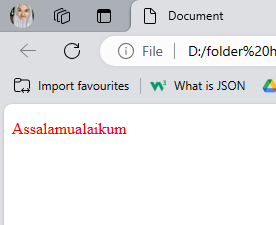

# Cara pemanggilan CSS
1. **External Metode:** Ini merupakan cara paling umum untuk menggunakan CSS. Dalam external metode, Anda menuliskan seluruh kode CSS dalam file CSS terpisah, dan memanggilnya di dalam file HTML menggunakan tag `<link>` di dalam tag `<head>` HTML.
Contoh :
```html
<head>
  <link rel="stylesheet" href="style.css">
</head>
<body>
  <p>welcome css!</p>
</body>
```

2. **Internal Metode:** Pada internal metode, Anda menuliskan kode CSS di dalam tag `<style>` di dalam tag `<head>` halaman HTML.
Contoh : 
```html
<head>
  <style>
    p {
      color: red;
    }
  </style>
</head>
<body>
  <p>welcome css!</p>
</body>
```

3. **inline Metode:** Pada inline metode, Anda menuliskan atribut `style` langsung di dalam tag HTML.
Contoh : 
```html
<p style="color: red;">welcome css!</p>
```
# Selector
1. **Element Selector:** Elemen selector digunakan untuk mengidentifikasi elemen HTML yang akan diubah, dengan cara menggunakan nama elemen HTML itu sendiri.
```css
p {
  color: red;
}
```
2. **Class Selector:** Class selector digunakan untuk mengidentifikasi elemen HTML yang memiliki atribut `class` tertentu.
```css
.merah {
  color: red;
}
```
3. **ID Selector:** ID selector digunakan untuk mengidentifikasi elemen HTML yang memiliki atribut `id` tertentu.
```css
#hijau {
    color: green;
}
```
# TEXT
## Text align
### PENJELASAN
- `text-align:left;` Text akan ditampilkan di sebelah kiri dokumen.
- `text-align:right;` Text akan ditampilkan di sebelah kanan dokumen.
-  `text-align:center;` Text akan ditampilkan di tengah-tengah dokumen.
-  `text-align:justify;` Text akan ditampilkan dengan mengikuti spasi yang ada di antara kata-kata.
### KODE PROGRAM
```css
css
p {
text-align: center;
}
```
### HASIL
#### BEFORE
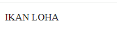
#### AFTER
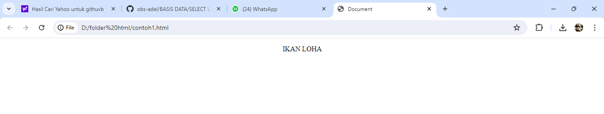
### KESIMPULAN
dari kode program yang diberikan p { text-align: center; } adalah bahwa kode ini mengatur properti CSS text-align untuk elemen `<p>` (paragraf) dalam sebuah dokumen HTML. Dengan nilai center, semua teks dalam elemen `<p> `akan diatur ke tengah dari elemen tersebut.

# BACKGROUND
## Penjelasan
Properti dalam CSS digunakan untuk mengatur latar belakang suatu elemen. Ini dapat digunakan untuk mengatur warna latar belakang, gambar, pola ulang, dan atribut latar belakang lainnya.
1. `background-color` : Properti ini digunakan untuk mengatur warna latar belakang suatu elemen. Ini dapat diatur ke nama warna, kode warna heksadesimal, atau nilai RGB.
2. `background-repeat` : Properti ini digunakan untuk mengatur apakah gambar latar belakang harus diulang atau tidak. Ini dapat diatur untuk mengulangi, tidak-mengulangi, mengulangi-x, atau mengulangi-y.
3. `background-image` : Properti ini digunakan untuk mengatur gambar sebagai latar belakang elemen. Itu dapat diatur ke URL file gambar.
4. `background-position` : Properti ini digunakan untuk mengatur posisi gambar latar belakang.
## Kode Program
```css
background-color: red;
```
## Hasil
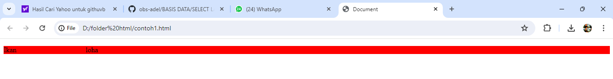
### Kesimpulan
`background-color` digunakan untuk mengatur warna latar belakang elemen, dan dapat diatur menggunakan berbagai nilai.
# BOX-MODEL
## PADDING
### Penjelasan
`padding` adalah sebuah properti CSS yang digunakan untuk menentukan jarak antara konten elemen dan garis batas elemen tersebut. Properti `padding` dapat diatur pada semua direksi, yaitu atas, bawah, kiri, dan kanan. Untuk mengatur `padding` pada direksi tertentu, gunakan properti `padding-top`, `padding-bottom`, `padding-left`, dan `padding-right`.
1. `padding-top`: Properti ini digunakan untuk menentukan jarak antara konten elemen dan garis atas elemen tersebut.
2. `padding-bottom`: Properti ini digunakan untuk menentukan jarak antara konten elemen dan garis bawah elemen tersebut.
3. `padding-left`: Properti ini digunakan untuk menentukan jarak antara konten elemen dan garis kiri elemen tersebut.
4. `padding-right`: Properti ini digunakan untuk menentukan jarak antara konten elemen dan garis kanan elemen tersebut.
### Kode Program
```css
.button1 {
    background-color: pink;
    width: 100px;
    height: 50px;
   border: 5px solid palevioletred;
   border-radius: 10px 15px;
   padding-left: 0px;
   padding-bottom: 50px;
   padding-right: 50px;
   padding-top: 50px;
```
### Hasil
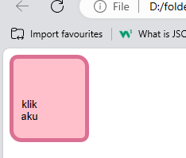
### Kesimpulan 
Properti `padding` adalah properti CSS yang digunakan untuk menentukan jarak antara konten elemen dan garis batas elemen tersebut.
## MARGIN
### Penjelasan
`margin` adalah properti CSS yang digunakan untuk menentukan jarak antara elemen dan elemen lainnya atau antara elemen dan area konten halaman. Properti `margin` dapat diatur pada semua direksi, yaitu atas, bawah, kiri, dan kanan. Untuk mengatur `padding` pada direksi tertentu, gunakan properti `margin-top`, `margin-bottom`, `margin-left`, dan `margin-right`.
1. `margin-top`: menetapkan margin atas elemen, yang merupakan spasi di atas elemen.
2. `margin-bottom`: menetapkan margin bawah elemen, yang merupakan spasi di bawah elemen.
3.  margin-left`: mengatur margin kiri elemen, yang merupakan spasi di sebelah kiri elemen.
4. `margin-right`: menetapkan margin kanan elemen, yang merupakan spasi di sebelah kanan elemen.

### Kode Program
```css
.button2 {
    background-color: pink;
    width: 100px;
    height: 50px;
    border: 0px;
    margin-top: 600x;
    margin-bottom: 600px;
    margin-left: 500px;
    margin-right: 100px;
}
```
### Hasil
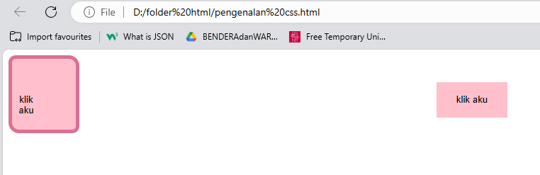

### Kesimpulan 
`margin` adalah properti singkatan untuk mengatur margin elemen di empat arah atas, kanan, bawah, dan kiri.
## BORDER
### Penjelasan
Properti dalam CSS digunakan untuk mengatur batas elemen.  
1. `border-width` : Properti ini digunakan untuk mengatur lebar perbatasan. dapat diatur ke nilai panjang, seperti piksel
2. `border-style` : Properti ini digunakan untuk mengatur gaya perbatasan. dapat diatur ke nilai seperti solid, putus-putus, putus-putus, atau tidak ada.
3. `border-color` : Properti ini digunakan untuk mengatur warna perbatasan. dapat diatur ke nama warna, kode warna heksadesimal
### Kode Program
```css
button {
    border-color: violet;
    border-width: 15000px;
    border-style: initial;
}
```
### Hasil
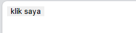
### Kesimpulan 
Properti menetapkan warna perbatasan menjadi ungu. Properti menetapkan lebar batas ke 15000px. Namun, nilai ini biasanya jauh lebih besar dari yang diperlukan dan mungkin tidak praktis secara visual.`border-color``border-width`    

# Transition
## Penjelasan
1.  `Transition-property` : atribut yang digunakan untuk transisi yang apabila kursor didekatkan maka transisi akan berfungsi.
2. `Transition-duration` : Properti ini `transition-duration`menentukan berapa detik (s) atau milidetik (ms) yang diperlukan untuk menyelesaikan efek transisi.
3. `Transition-timing function` : Properti `transition-timing-function`menentukan kurva kecepatan efek transisi. Properti ini memungkinkan efek transisi untuk mengubah kecepatan sepanjang durasinya
## Kode program
```css
div {
  width: 100px;
  height: 100px;
  background: blueviolet;
  transition: width 2s;
  transition-timing-function: linear;
}
div:hover {
  width: 300px;
}
```
## Hasil
### Before
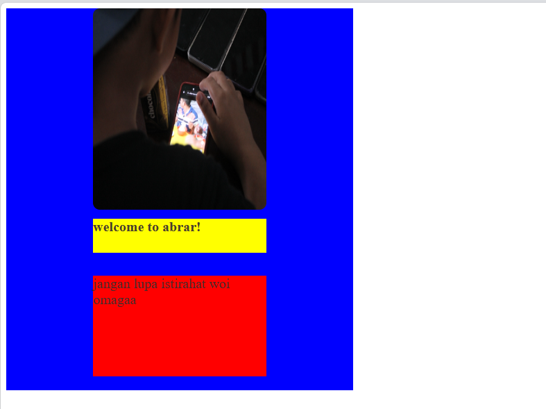
### After
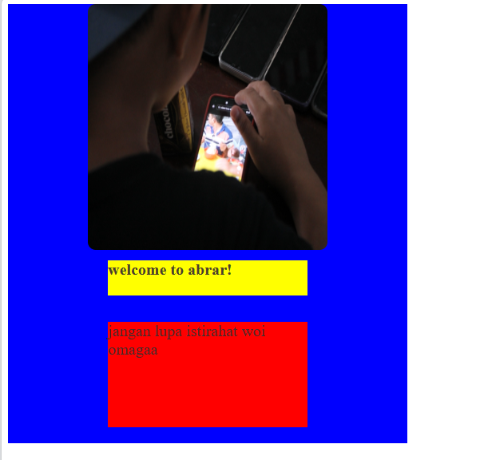
## Kesimpulan
Kesimpulannya, properti-properti transisi seperti `transition-property`, `transition-duration`, dan `transition-timing-function` digunakan bersama-sama untuk mengontrol efek transisi pada elemen-elemen di halaman web.
# Transform
`Transform` adalah untuk mengubah tampilan elemen HTML, seperti menggeser, memutar, atau mengubah ukurannya ketika di klik. Ini adalah cara untuk membuat animasi sederhana atau mengatur posisi elemen dengan lebih fleksibel, atau lebih singkatnya mengubah gaya pada suatu elemen HTML ketika diklik.
## Penjelasan
Fungsi mengubah ukuran elemen, dan nilainya berarti elemen tersebut akan diskalakan ke ukuran aslinya. Jadi, kode tidak akan mengubah tampilan visual elemen.`transform: scale(1.0)``scale()``1.0``transform: scale(1.0)`
## Kode Program
```css
.box-item-1:hover {
    transform: scale(1.0);
```
## Hasil
### Before
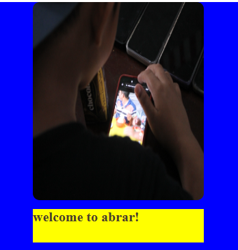
### After
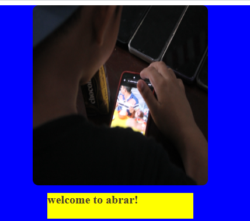
# FLEX-BLOX
## FLEX-CONTAINER
### Penjelasan
Flex container adalah elemen induk yang mengatur tata letak flex item-nya. flexbox yaitu memberikan container kemampuan untuk mengatur panjang, lebar, dan posisi item-item yang berada di dalamnya agar memaksimalkan ruang yang ada. Pengaturan ini sangat penting bagi seorang frontend developer untuk membuat sebuah website yang nyaman dilihat di berbagai device dengan berbagai macam resolus.
1. `flex-direction` :Menentukkan arah (direction) yang akan diberlakukan untuk item-item yang ada pada container flexbox.
2. `flex-wrap` :Digunakan untuk mendefinisikan bahwa elemen item di dalam container flexbox tidak harus disejajarkan dalam satu baris.
3. `justify-content` :Digunakan untuk mensejajarkan item-item diantara flexbox agar container dari flexbox tersebut bisa mendistribusikan ruang kosong yang tersisa ketika item flex dalam satu baris tersebut tidak flexsibel atau meskipun flexsibel tapi sudah mencapai batas ukuran maksimum.
4. `align-items` :Mendefinisikan bagaimana item-item pada container flex tersebut diletakkan sepanjang garis tegak lurus pada sumbu utama (cross-axis).
5. `align-content` :Digunakan untuk mensejajarkan garis flex container ketika ada ruang kosong secara garis tegak lurus pada sumbu utama (cross-axis).
### Kode Program

```css
.contrainer {
    display: flex;
    height: 100vh;
    justify-content: space-around ;
    align-items: center  ;
    background-color: blanchedalmond;
}
```
### Hasil
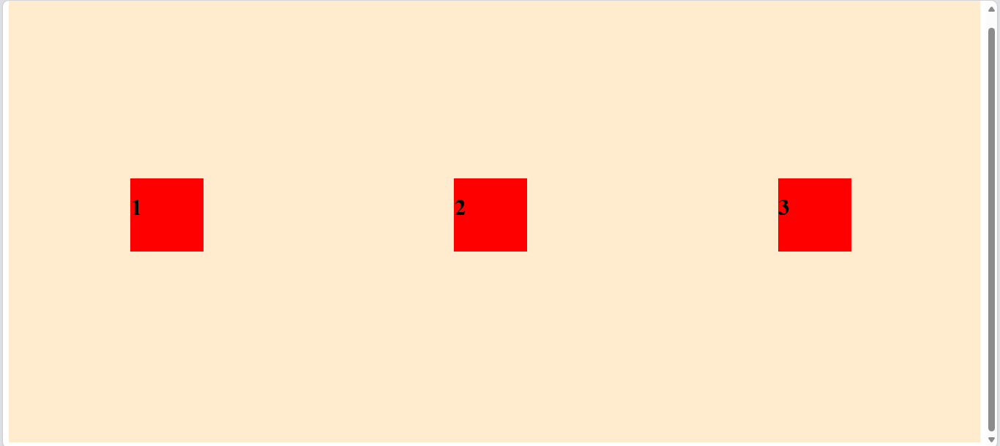
