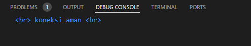
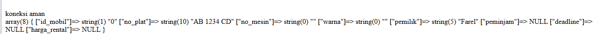
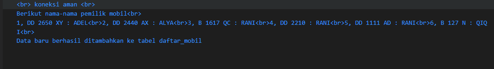
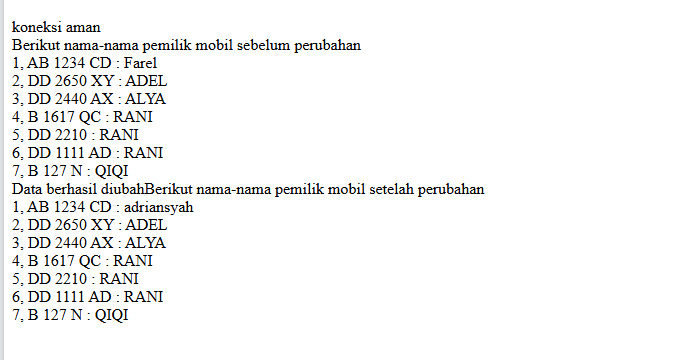
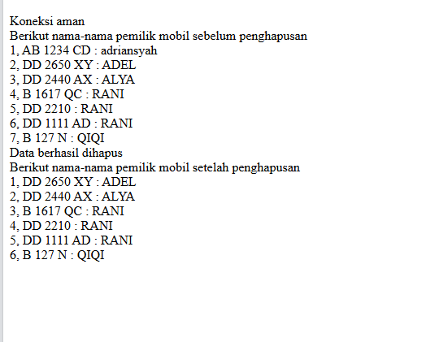

# Koneksi DataBase
**Kode Program:**
```php
<php

//koneksi ke database
$koneksi = mysqli_connect('localhost', 'root', '', 'rental_adel);
  
if ($koneksi) {
    echo "<br> koneksi aman <br>";
} else {
     echo "error, tidak bisa koneksi ke database";
}

  
//jalankan query seleksi
//$select = mysqli_query($koneksi, "SELECT * FROM daftar_mobil");
  
// //membuat array dan memecah data berdasarkan kolomnya
// $result = mysqli_fetch_assoc($select);

// //menampilkan struktur array dari data tabel yang dijalankan di atas
// // var_dump($result);


// echo 'Berikut nama-nama pemilik mobil<br>';

// $a = 1; 
// foreach($select as $key => $data){ 

//     echo $a++ . ", " . $data ['no_plat'] . " : " . $data ['pemilik'] . '<br>';

// }


// // echo '<p>Halo ' . $result['pemilik'] . '!!</p><br>';
```
## Hasil

## Analisis
Koneksi ke database:
 Menggunakan fungsi `mysqli_connect()` untuk membuat koneksi ke database MySQL dengan parameter host ('localhost'), username ('root'), password (''), dan nama database ('rental_rahmat').  Jika koneksi berhasil, maka pesan "koneksi aman" akan ditampilkan. Jika tidak, pesan "error, tidak bisa koneksi ke database" akan ditampilkan.
## Kesimpulan
Program PHP dan SQL di atas bertujuan untuk melakukan koneksi ke database MySQL menggunakan fungsi `mysqli_connect()`. Setelah koneksi berhasil, pesan "koneksi aman" akan ditampilkan. Jika terdapat masalah dalam koneksi, maka pesan "error, tidak bisa koneksi ke database" akan ditampilkan.
Namun, pada kode yang diberikan, tag pembuka PHP ditulis sebagai "<php" yang seharusnya "<php" (dengan tanda "?"). Pastikan untuk mengubahnya menjadi "<php" agar kode PHP dapat dieksekusi dengan benar.
# Tampilkan Data
## Kode Program
```php
<?php

//koneksi ke database
$koneksi = mysqli_connect('localhost', 'root', '', 'rental_rahmat');
  
if ($koneksi) {
    echo "<br> koneksi aman <br>";
} else {
    echo "error, tidak bisa koneksi ke database";
}
  
//jalankan query seleksi
$select = mysqli_query($koneksi, "SELECT * FROM daftar_mobil");

// //membuat array dan memecah data berdasarkan kolomnya
// $result = mysqli_fetch_assoc($select);
  
//menampilkan struktur array dari data tabel yang dijalankan di atas
// var_dump($result);
  
echo 'Berikut nama-nama pemilik mobil<br>';

$a = 1;
foreach($select as $key => $data){
    echo $a++ . ", " . $data ['no_plat'] . " : " . $data ['pemilik'] . '<br>';
}
  
// echo '<p>Halo ' . $result['pemilik'] . '!!</p><br>';
```
## Hasil

## Analisis
1. Koneksi ke database:
- Menggunakan fungsi `mysqli_connect()` untuk membuat koneksi ke database MySQL dengan parameter host ('localhost'), username ('root'), password (''), dan nama database ('rental_rahmat').
- Jika koneksi berhasil, maka pesan "koneksi aman" akan ditampilkan. Jika tidak, pesan "error, tidak bisa koneksi ke database" akan ditampilkan.
3. Jalankan query seleksi:
- Menggunakan fungsi `mysqli_query()` untuk menjalankan query SQL yang melakukan seleksi data dari tabel "daftar_mobil" dalam database.
- Hasil query disimpan dalam variabel `$select`.
4. Menampilkan data:
- Menampilkan pesan "Berikut nama-nama pemilik mobil" sebagai judul.
- Menggunakan perulangan `foreach` untuk mengiterasi setiap baris data yang ditemukan dalam `$select`.
- Setiap baris data ditampilkan dengan format nomor plat mobil dan nama pemiliknya.

## Kesimpulan
Program PHP dan SQL di atas berfungsi untuk melakukan koneksi ke database, menjalankan query seleksi, dan menampilkan data dari tabel "daftar_mobil". Program ini akan menampilkan nama-nama pemilik mobil yang ada dalam tabel tersebut dengan format nomor plat dan nama pemilik.
Namun, perlu diperhatikan bahwa bagian yang mengakses data menggunakan `$select` dalam perulangan `foreach` tidak tepat. Seharusnya, variabel `$select` diganti dengan `mysqli_fetch_assoc($select)` untuk mengambil setiap baris data secara berurutan. Dalam kode yang diberikan, perulangan `foreach` tidak akan berfungsi dengan benar. Jika ingin menampilkan semua baris data, perlu dilakukan perubahan pada kode tersebut.
# Tambahkan Data
## Kode Program
```php
<?php
  
//koneksi ke database
$koneksi = mysqli_connect('localhost', 'root', '', 'rental_adel');

if ($koneksi) {
    echo "<br> koneksi aman <br>";
} else {
    echo "error, tidak bisa koneksi ke database";
}


//jalankan query seleksi
$select = mysqli_query($koneksi, "SELECT * FROM daftar_mobil");
  

//menampilkan struktur array dari data tabel yang dijalankan di atas
// var_dump($result);
  

echo 'Berikut nama-nama pemilik mobil<br>';
  
$a = 1;
foreach($select as $key => $data){
    echo $a++ . ", " . $data['no_plat'] . " : " . $data['pemilik'] . '<br>';
}
  
//Tambahkan data baru ke tabel daftar_mobil
$no_plat_baru = "AB 1234 CD";
$pemilik_baru = "John Doe";
  
$insert = mysqli_query($koneksi, "INSERT INTO daftar_mobil (no_plat, pemilik) VALUES ('$no_plat_baru', '$pemilik_baru')");
  
if ($insert) {
    echo "Data baru berhasil ditambahkan ke tabel daftar_mobil";
} else {
    echo "Gagal menambahkan data baru ke tabel daftar_mobil";
}

// echo '<p>Halo ' . $result['pemilik'] . '!!</p><br>';

?>
```
## Hasil

## Analisis
1. Koneksi ke database:
- Menggunakan fungsi `mysqli_connect()` untuk membuat koneksi ke database MySQL dengan parameter host ('localhost'), username ('root'), password (''), dan nama database ('rental_rahmat').
- Jika koneksi berhasil, maka pesan "koneksi aman" akan ditampilkan. Jika tidak, pesan "error, tidak bisa koneksi ke database" akan ditampilkan.
2. Jalankan query seleksi:
 - Menggunakan fungsi `mysqli_query()` untuk menjalankan query SQL yang melakukan seleksi data dari tabel "daftar_mobil" dalam database.
 - Hasil query disimpan dalam variabel `$select`.
3. Menampilkan data:
- Menampilkan pesan "Berikut nama-nama pemilik mobil" sebagai judul.
- Menggunakan perulangan `foreach` untuk mengiterasi setiap baris data yang ditemukan dalam `$select`.
- Setiap baris data ditampilkan dengan format nomor plat mobil dan nama pemiliknya.
4. Menambahkan data baru:
- Menambahkan data baru ke tabel "daftar_mobil" dengan menggunakan fungsi `mysqli_query()` untuk menjalankan query SQL INSERT.
- Data baru yang ditambahkan adalah nomor plat baru dan pemilik baru yang disimpan dalam variabel `$no_plat_baru` dan `$pemilik_baru`.
-
**Kesimpulan:**
Program PHP dan SQL di atas berfungsi untuk melakukan koneksi ke database, menjalankan query seleksi, menampilkan data dari tabel "daftar_mobil", dan menambahkan data baru ke tabel tersebut. Program ini akan menampilkan nama-nama pemilik mobil yang ada dalam tabel, kemudian menambahkan data baru dengan nomor plat dan pemilik yang ditentukan.
Harap diingat bahwa sebelum menjalankan program ini, pastikan koneksi ke database telah berhasil dan struktur tabel "daftar_mobil" telah sesuai. Juga, perhatikan bahwa program ini menggunakan data yang telah ditentukan sebelumnya untuk penambahan data baru. Anda dapat mengubah nilai variabel `$no_plat_baru` dan `$pemilik_baru` sesuai dengan data yang ingin ditambahkan.
# Ubah Data
**Kode Program:**
```php
<?php
  
//koneksi ke database
$koneksi = mysqli_connect('localhost', 'root', '', 'rental_rahmat');

if ($koneksi) {
    echo "<br> koneksi aman <br>";
} else {
    echo "error, tidak bisa koneksi ke database";
}

//jalankan query seleksi
$select = mysqli_query($koneksi, "SELECT * FROM daftar_mobil");
  
echo 'Berikut nama-nama pemilik mobil sebelum perubahan<br>';
  
$a = 1;
foreach($select as $key => $data){
    echo $a++ . ", " . $data['no_plat'] . " : " . $data['pemilik'] . '<br>';
}

//Ubah data dalam tabel daftar_mobil
$no_plat_lama = "AB 1234 CD";
$pemilik_baru = "Amir";

$update = mysqli_query($koneksi, "UPDATE daftar_mobil SET pemilik='$pemilik_baru' WHERE no_plat='$no_plat_lama'");

if ($update) {
    echo "Data berhasil diubah";
} else {
    echo "Gagal mengubah data";
}

//jalankan query seleksi setelah perubahan
$select_after_update = mysqli_query($koneksi, "SELECT * FROM daftar_mobil");

echo 'Berikut nama-nama pemilik mobil setelah perubahan<br>';

$a = 1;
foreach($select_after_update as $key => $data){
    echo $a++ . ", " . $data['no_plat'] . " : " . $data['pemilik'] . '<br>';
}

?>
```
**Hasil:**

**Analisis:**
1. Koneksi ke database:
    - Menggunakan fungsi `mysqli_connect()` untuk membuat koneksi ke database MySQL dengan parameter host ('localhost'), username ('root'), password (''), dan nama database ('rental_rahmat').
    - Jika koneksi berhasil, maka pesan "koneksi aman" akan ditampilkan. Jika tidak, pesan "error, tidak bisa koneksi ke database" akan ditampilkan.
2. Jalankan query seleksi:
    - Menggunakan fungsi `mysqli_query()` untuk menjalankan query SQL yang melakukan seleksi data dari tabel "daftar_mobil" dalam database.
    - Hasil query disimpan dalam variabel `$select`.
3. Menampilkan data sebelum perubahan:
    - Menampilkan pesan "Berikut nama-nama pemilik mobil sebelum perubahan" sebagai judul.
    - Menggunakan perulangan `foreach` untuk mengiterasi setiap baris data yang ditemukan dalam `$select`.
    - Setiap baris data ditampilkan dengan format nomor plat mobil dan nama pemiliknya.
4. Ubah data dalam tabel daftar_mobil:
    - Menggunakan query SQL UPDATE untuk mengubah data dalam tabel daftar_mobil.
    - Data yang akan diubah adalah pemilik mobil dengan nomor plat lama yang disimpan dalam variabel `$no_plat_lama`, dengan pemilik baru yang ditetapkan dalam variabel `$pemilik_baru.
5. Menampilkan data setelah perubahan:
    - Menampilkan pesan "Berikut nama-nama pemilik mobil setelah perubahan" sebagai judul.
    - Menjalankan query seleksi lagi setelah perubahan.
    - Menggunakan perulangan `foreach` untuk mengiterasi setiap baris data yang ditemukan dalam `$select_after_update`.
    - Setiap baris data ditampilkan dengan format nomor plat mobil dan nama pemiliknya.
**Kesimpulan:**
Program PHP dan SQL di atas berfungsi untuk melakukan koneksi ke database, menjalankan query seleksi, menampilkan data sebelum perubahan, mengubah data dalam tabel "daftar_mobil", dan menampilkan data setelah perubahan. Program ini akan menampilkan nama-nama pemilik mobil sebelum dan setelah perubahan yang dilakukan. 
Pastikan koneksi ke database telah berhasil dan struktur tabel "daftar_mobil" sesuai sebelum menjalankan program ini. Perhatikan bahwa program ini mengubah data pemilik mobil dengan nomor plat lama tertentu menjadi pemilik baru yang ditetapkan. Anda dapat mengubah nilai variabel `$no_plat_lama` dan `$pemilik_baru` sesuai dengan data yang ingin diubah.
# Hapus Data
**Kode Program:**
```php
<?php

// Koneksi ke database
$koneksi = mysqli_connect('localhost', 'root', '', 'rental_rahmat');

  
if ($koneksi) {
    echo "<br> Koneksi aman <br>";
} else {
    echo "Error, tidak bisa koneksi ke database";
}
  
// Jalankan query seleksi
$select = mysqli_query($koneksi, "SELECT * FROM daftar_mobil");
echo 'Berikut nama-nama pemilik mobil sebelum penghapusan<br>';

$a = 1;
foreach ($select as $key => $data) {
    echo $a++ . ", " . $data['no_plat'] . " : " . $data['pemilik'] . '<br>';
}


// Hapus data dalam tabel daftar_mobil
$no_plat_hapus = "AB 1234 CD";

$delete = mysqli_query($koneksi, "DELETE FROM daftar_mobil WHERE no_plat='$no_plat_hapus'");
  
if ($delete) {
    echo "Data berhasil dihapus<br>";
} else {
    echo "Gagal menghapus data";
}

  
// Jalankan query seleksi setelah penghapusan
$select_after_delete = mysqli_query($koneksi, "SELECT * FROM daftar_mobil");
  
echo 'Berikut nama-nama pemilik mobil setelah penghapusan<br>';
  
$a = 1;
foreach ($select_after_delete as $key => $data) {
    echo $a++ . ", " . $data['no_plat'] . " : " . $data['pemilik'] . '<br>';
}
  
?>
```
**Hasil:**

**Analisis:**
1. Koneksi ke database:
    - Menggunakan fungsi `mysqli_connect()` untuk membuat koneksi ke database MySQL dengan parameter host ('localhost'), username ('root'), password (''), dan nama database ('rental_rahmat').
    - Jika koneksi berhasil, maka pesan "koneksi aman" akan ditampilkan. Jika tidak, pesan "Error, tidak bisa koneksi ke database" akan ditampilkan.
2. Jalankan query seleksi:
    - Menggunakan fungsi `mysqli_query()` untuk menjalankan query SQL yang melakukan seleksi data dari tabel "daftar_mobil" dalam database.
    - Hasil query disimpan dalam variabel `$select`.
3. Menampilkan data sebelum penghapusan:
    - Menampilkan pesan "Berikut nama-nama pemilik mobil sebelum penghapusan" sebagai judul.
    - Menggunakan perulangan `foreach` untuk mengiterasi setiap baris data yang ditemukan dalam `$select`.
    - Setiap baris data ditampilkan dengan format nomor plat mobil dan nama pemiliknya.
4. Hapus data dalam tabel daftar_mobil:
    - Menggunakan query SQL DELETE untuk menghapus data dari tabel daftar_mobil.
    - Data yang akan dihapus adalah baris dengan nomor plat yang sesuai dengan nilai variabel `$no_plat_hapus`.
5. Menampilkan data setelah penghapusan:
    - Menampilkan pesan "Berikut nama-nama pemilik mobil setelah penghapusan" sebagai judul.
    - Menjalankan query seleksi lagi setelah penghapusan data.
    - Menggunakan perulangan `foreach` untuk mengiterasi setiap baris data yang ditemukan dalam `$select_after_delete`.
    - Setiap baris data ditampilkan dengan format nomor plat mobil dan nama pemiliknya.
**Kesimpulan:**
Program PHP dan SQL di atas berfungsi untuk melakukan koneksi ke database, menjalankan query seleksi, menampilkan data sebelum penghapusan, menghapus data dalam tabel "daftar_mobil", dan menampilkan data setelah penghapusan. Program ini akan menampilkan nama-nama pemilik mobil sebelum dan setelah penghapusan yang dilakukan.
Pastikan koneksi ke database telah berhasil dan struktur tabel "daftar_mobil" sesuai sebelum menjalankan program ini. Perhatikan bahwa program ini menghapus data dengan nomor plat tertentu yang ditentukan oleh nilai variabel `$no_plat_hapus`. Anda dapat mengubah nilai variabel tersebut sesuai dengan nomor plat yang ingin dihapus.