# Apa itu Web Dinamis?

Web dinamis adalah jenis situs web yang dapat menghasilkan konten yang berubah atau disesuaikan secara dinamis berdasarkan permintaan pengguna. Konten dinamis dapat dihasilkan melalui interaksi dengan pengguna, pengambilan data dari basis data, integrasi dengan layanan eksternal, dan pemrosesan logika bisnis. Web dinamis menggunakan bahasa pemrograman server-side untuk menghasilkan dan mengelola konten dinamis ini.

# Apa itu PHP?

PHP (PHP: Hypertext Preprocessor) adalah salah satu bahasa pemrograman yang sering digunakan untuk mengembangkan web dinamis. PHP adalah bahasa pemrograman sisi server yang dirancang khusus untuk pengembangan web. Itu dapat diintegrasikan dengan HTML untuk menghasilkan konten dinamis. PHP berjalan di sisi server, yang berarti kode PHP dieksekusi di server web sebelum hasilnya dikirim ke browser pengguna.
# Program pertama PHP
## Cara 
1. Buka XAMPP, kemudian klik tombol start pada 'apache'
2. Open file manager
3. Open di Drive D
4. Kemudian Open folder XAMPP
5. Lalu open folder htdocs
6. Buat folder baru di dalam htdocs 
7. Lalu open folder yang sudah Anda buat
8. Open VSCode
9. Open folder yang sudah Anda buat di VSCode
10. Buat file baru di VSCode dengan ekstensi .php di folder yang sudah Anda buka

# Echo
## Kutip satu
kutip satu hanya bisa membaca teks atau STRING, variabel dan string
dipisahkan dengan tanda titik
## Kutip dua
kutip dua bisa membaca nilai dari variabel
# Komentar
## Single line
```php
//ini komentar 1 baris menggunakan dua slice
```

## Multiple line
```php
/*
ini
komentar
multibaris
menggunakan satu slice dan bintang
*/
```

# Variabel & Konstanta

# Apa itu web dinamis dan PHP?

>[!WEB DINAMIS]
>Web dinamis adalah jenis situs web yang dapat menghasilkan konten yang berubah atau disesuaikan secara dinamis berdasarkan permintaan pengguna. Konten dinamis dapat dihasilkan melalui interaksi dengan pengguna, pengambilan data dari basis data, integrasi dengan layanan eksternal, dan pemrosesan logika bisnis. Web dinamis menggunakan bahasa pemrograman server-side untuk menghasilkan dan mengelola konten dinamis ini.

>[!PHP]
>PHP (PHP: Hypertext Preprocessor) adalah salah satu bahasa pemrograman yang sering digunakan untuk mengembangkan web dinamis. PHP adalah bahasa pemrograman sisi server yang dirancang khusus untuk pengembangan web. Itu dapat diintegrasikan dengan HTML untuk menghasilkan konten dinamis. PHP berjalan di sisi server, yang berarti kode PHP dieksekusi di server web sebelum hasilnya dikirim ke browser pengguna.
# Program pertama PHP
## Cara 
1. Buka XAMPP, kemudian klik tombol start pada 'apache'
2. Open file manager
3. Open di Drive D
4. Kemudian Open folder XAMPP
5. Lalu open folder htdocs
6. Buat folder baru di dalam htdocs 
7. Lalu open folder yang sudah Anda buat
8. Open VSCode
9. Open folder yang sudah Anda buat di VSCode
10. Buat file baru di VSCode dengan ekstensi .php di folder yang sudah Anda buka

# Echo & commentar
## Echo
1. Penggunaan Dasar:
   - echo adalah perintah dasar dalam PHP yang digunakan untuk menampilkan teks atau nilai pada halaman web.
   - Anda dapat menggunakan echo untuk menampilkan teks statis atau untuk menampilkan nilai dari variabel atau ekspresi.
   - echo dapat menerima satu atau lebih argumen yang dipisahkan oleh tanda titik (.) untuk menggabungkan teks dan variabel.

2. Menampilkan Teks:
   - Anda dapat menggunakan echo untuk langsung menampilkan teks statis dalam tanda kutip ganda ("") atau tanda kutip tunggal ('').
   - Contoh: `echo "Halo, dunia!";`

3. Menampilkan Nilai Variabel:
   - Anda dapat menggunakan echo untuk menampilkan nilai dari variabel dalam teks yang ditampilkan.
   - Gunakan operator konkatenasi (tanda titik) untuk menggabungkan teks dan variabel.
   - Contoh: 
    ```php
$nama = "John Doe";
echo "Halo, nama saya " . $nama . "."; 
```

4. Menampilkan HTML:
   - Selain teks, Anda juga dapat menggunakan echo untuk menampilkan kode HTML di dalam skrip PHP.
   - Uji coba berikut menunjukkan penggunaan echo untuk menampilkan elemen HTML:
```php
echo "<h1>Selamat Datang!</h1>";
echo "<p>Ini adalah halaman web PHP.</p>";
```

5. Penggunaan Kutipan:
   - Anda dapat menggunakan tanda kutip ganda ("") atau tanda kutip tunggal ('') untuk mengelilingi teks dalam echo.
   - Misalnya, `echo "Halo, nama saya 'John'.";`

6. Menggunakan Pemisah:
   - Saat menggunakan echo dengan beberapa argumen, Anda dapat menggunakan koma (,) sebagai pemisah antara argumen.
   - Contoh: `echo "Halo,", " nama saya ", $nama, ".";`

Materi echo pada PHP memungkinkan Anda untuk menampilkan teks, nilai variabel, dan bahkan kode HTML di dalam skrip PHP. Hal ini berguna dalam menghasilkan tampilan dinamis pada halaman web yang sedang Anda bangun.

## Struktur dasar echo
1. `<?php dan ?>`: Adalah penanda awal dan akhir dari blok kode PHP. Semua kode PHP harus berada di antara penanda ini agar dapat dieksekusi dengan benar.
2. echo: Adalah perintah dalam PHP yang digunakan untuk menampilkan teks atau nilai ke dalam halaman web.
3. teks atau nilai yang ingin ditampilkan: Adalah bagian di mana Anda memasukkan teks statis, nilai variabel, atau ekspresi matematika yang ingin ditampilkan di halaman web.

Jadi, ketika kode tersebut dieksekusi, teks atau nilai yang ditentukan akan ditampilkan di halaman web sebagai hasil dari perintah echo.
Kode program
php
```php
<?php
    echo "Halo, dunia!";
?>
```

Hasil:

```
Halo, dunia!
```

## Commentar
Dalam PHP, komentar digunakan untuk memberikan penjelasan, catatan, atau dokumentasi di dalam kode program. Komentar tidak akan dieksekusi oleh interpreter PHP, sehingga komentar tidak akan mempengaruhi hasil program.
Berikut adalah beberapa hal yang perlu diketahui tentang komentar dalam PHP:
1. Komentar Satu Baris:
   - Komentar satu baris dimulai dengan tanda // atau #.
   - Semua teks setelah tanda tersebut hingga akhir baris diabaikan oleh interpreter PHP.
   - Contoh:
```php
// Ini adalah komentar satu baris
$nama = "John Doe"; // Ini adalah komentar di samping kode
```
2. Komentar Multibaris:
   - Komentar multibaris dimulai dengan /* dan diakhiri dengan */.
   - Semua teks di antara tanda tersebut diabaikan oleh interpreter PHP.
   - Komentar multibaris dapat mencakup beberapa baris kode.
   - Contoh:
    ```php
     /*
         Ini adalah komentar multibaris.
         Ini dapat mencakup beberapa baris kode.
     */
     $umur = 25; 
```
3. Komentar Dokumentasi:
   - Komentar dokumen atau DocBlock digunakan untuk memberikan dokumentasi formal pada fungsi, kelas, atau metode.
   - Komentar dokumen dimulai dengan /** dan diakhiri dengan */.
   - Komentar ini sering digunakan dengan format khusus seperti PHPDoc untuk menghasilkan dokumentasi otomatis.
   - Contoh:
```php
     /**
      * Fungsi ini menghitung jumlah dua angka.
      *
      * @param int $a Angka pertama
      * @param int $b Angka kedua
      * @return int Hasil penjumlahan
      */
     function tambah($a, $b) {
         return $a + $b;
     }
    
``` 
4. Tujuan Penggunaan Komentar:
   - Memberikan penjelasan tentang tujuan dan fungsionalitas kode.
   - Membantu dalam pemeliharaan dan pemahaman kode untuk pengembang dan anggota tim lainnya.
   - Menyembunyikan atau menonaktifkan sebagian kode untuk uji coba atau sementara.
   - Meninggalkan catatan atau pesan kepada diri sendiri atau pengembang lain tentang kode tertentu.
Penggunaan komentar yang baik sangat penting dalam pemrograman untuk menjaga kejelasan dan keberlanjutan kode. Dengan menggunakan komentar yang tepat, Anda dapat meningkatkan kemudahan pemeliharaan dan kolaborasi dalam pengembangan perangkat lunak.
# Variable, const, operator
## Variable
Variabel pada PHP merupakan suatu wadah atau tempat untuk menyimpan data. Variabel digunakan untuk menyimpan nilai-nilai yang akan digunakan dalam program PHP. Anda dapat memberikan nama pada variabel untuk mengidentifikasinya, dan kemudian menggunakan nama tersebut untuk mengakses nilai yang disimpan di dalamnya.

Dalam PHP, variabel bersifat dinamis, yang berarti Anda tidak perlu mendeklarasikan tipe data variabel sebelum menggunakannya. PHP akan secara otomatis menentukan tipe data variabel berdasarkan nilai yang Anda berikan.

Simbol $ pada PHP digunakan untuk menandakan sebuah variabel. Dalam PHP, setiap kali Anda ingin membuat, mengakses, atau memanipulasi nilai variabel, Anda perlu menggunakan simbol `$`diikuti dengan nama variabelnya.

Contoh penggunaan variabel pada PHP:
```php
$nama = "John Doe"; // Variabel $nama dengan nilai "John Doe"
$umur = 25; // Variabel $umur dengan nilai 25
$gaji = 2500.50; // Variabel $gaji dengan nilai 2500.50
$isActive = true; // Variabel $isActive dengan nilai true
```
## Const
Dalam PHP, const adalah kata kunci yang digunakan untuk mendefinisikan konstanta. Konstanta adalah nilai yang tidak dapat diubah selama eksekusi program. Setelah konstanta didefinisikan, nilainya tidak dapat diubah atau dilakukan penugasan ulang.
-  Konstanta didefinisikan menggunakan kata kunci const diikuti dengan nama konstanta dan nilainya.
- Nama konstanta biasanya ditulis dalam huruf besar (uppercase) untuk membedakan dengan variabel biasa.
- Nilai konstanta dapat berupa bilangan, string, boolean, atau ekspresi konstan lainnya.
Contoh:
```php
	const PI = 3.14;
    const NAMA_SITUS = "Website ABC";
    const STATUS_AKTIF = true;
```
## Operator
Operator dalam PHP adalah simbol atau tanda yang digunakan untuk melakukan operasi atau manipulasi pada nilai atau variabel. Operator memungkinkan Anda untuk melakukan perhitungan matematika, perbandingan, penggabungan teks, dan operasi logika dalam program PHP. 
Berikut ini beberapa jenis operator yang tersedia dalam PHP:
1. Operator Aritmatika:
   - Operator aritmatika digunakan untuk melakukan operasi matematika seperti penjumlahan, pengurangan, perkalian, pembagian, modulus, dan sebagainya.
   - Contoh:
```php
     $a = 10;
     $b = 5;
     $c = $a + $b; // Penjumlahan
     $d = $a - $b; // Pengurangan
     $e = $a * $b; // Perkalian
     $f = $a / $b; // Pembagian
     $g = $a % $b; // Modulus (sisa pembagian)
```

2. Operator Penugasan:
   - Operator penugasan digunakan untuk memberikan nilai ke variabel.
   - Contoh:
    ```php
     $a = 10; // Penugasan nilai 10 ke variabel $a
     $b += 5; // Penugasan nilai $b + 5 ke variabel $b (sama dengan $b = $b + 5)
```
3. Operator Perbandingan:
   - Operator pembanding digunakan untuk membandingkan dua nilai dan menghasilkan nilai kebenaran (true atau false).
   - Contoh:
    ```php
     $a = 10;
     $b = 5;
     $c = $a == $b; // Sama dengan
     $d = $a != $b; // Tidak sama dengan
     $e = $a > $b; // Lebih besar dari
     $f = $a < $b; // Lebih kecil dari
     $g = $a >= $b; // Lebih besar dari atau sama dengan
     $h = $a <= $b; // Lebih kecil dari atau sama dengan    
```
4. Operator Logika:
   - Operator logika digunakan untuk menggabungkan atau memanipulasi nilai kebenaran (true atau false).
   - Contoh:
```php
     $a = true;
     $b = false;
     $c = $a && $b; // Logika AND
     $d = $a || $b; // Logika OR
     $e = !$a; // Logika NOT
```
5. Operator String:
   - Operator string digunakan untuk menggabungkan atau memanipulasi teks.
   - Contoh:
    ```php
     $a = "Hello, ";
     $b = "World!";
     $c = $a . $b; // Penggabungan teks
```
     
6. Operator Lainnya:
   - Selain operator-operator di atas, PHP juga memiliki operator lain seperti operator increment (++) dan decrement (--), operator ternary (?:), operator array, dan lain-lain.

Operator dalam PHP memungkinkan Anda untuk melakukan berbagai operasi dan manipulasi pada data, dan memungkinkan logika dan fungsionalitas yang lebih kompleks dalam program Anda. Dalam pengembangan PHP, pemahaman tentang operator sangat penting untuk membuat kode yang efisien dan efektif.

# Conditional Statement
## IF
### Penjelasan
pernyataan `if` digunakan untuk mengimplementasikan kondisi. Ini memungkinkan Anda untuk menjalankan serangkaian kode tertentu jika kondisi yang diberikan terpenuhi.
### Struktur
```php
if (kondisi) {
    // Kode yang dijalankan jika kondisi benar
}
```
### Program
```php
$nilai = 75; // Contoh nilai input
// Pernyataan if
if ($nilai >= 80) {
    echo "Selamat! Anda lulus dengan nilai yang baik.";
```
### Hasil
### Analisis
program akan mengevaluasi kondisi secara berurutan. Jika `$nilai` lebih besar atau sama dengan 80, program akan menampilkan pesan "Selamat! Anda lulus dengan nilai yang baik.". Jika `$nilai` lebih besar atau sama dengan 80, program akan menampilkan pesan "Selamat! Anda lulus dengan nilai yang baik.".
### Kesimpulan
Program ini menggunakan pernyataan if untuk menguji nilai input. Jika nilai input lebih besar atau sama dengan 80, program akan menampilkan pesan "Selamat! Anda lulus dengan nilai yang baik." Jika nilai input lebih besar atau sama dengan 60, program akan menampilkan pesan "Anda lulus." Jika nilai input kurang dari 60, program akan menampilkan pesan "Maaf, Anda tidak lulus." Dalam contoh ini, dengan nilai input 75, program akan menampilkan pesan "Anda lulus."

## IF - ELSE
### Penjelasan
`else` dalam PHP digunakan untuk menentukan blok kode yang akan dieksekusi jika kondisi dalam pernyataan `if` sebelumnya tidak terpenuhi atau bernilai `false`. Ini memungkinkan program untuk menjalankan tindakan alternatif ketika kondisi `if` tidak terpenuhi.
### Struktur
```PHP
if (kondisi) {
    // Kode yang dijalankan jika kondisi benar
} else {
    // Kode yang dijalankan jika kondisi salah
}
```
### Program
```PHP
<?php
// Analisis
// Program ini menerima input berupa angka dan menampilkan pesan tergantung pada nilai angka tersebut.

$nilai = 75; // Contoh nilai input

// Pernyataan if
if ($nilai >= 80) {
    echo "Selamat! Anda lulus dengan nilai yang baik.";
} else {
    echo "Maaf, Anda tidak lulus.";
}
```
```
```
### Hasil
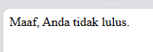
### Analisis
Dalam analisis, program akan mengevaluasi kondisi secara berurutan. Jika `$nilai` lebih besar atau sama dengan 80, program akan menampilkan pesan "Selamat! Anda lulus dengan nilai yang baik.". Jika ya, program akan menampilkan pesan "Anda lulus.". Jika kedua kondisi sebelumnya tidak terpenuhi, program akan menjalankan blok kode dalam pernyataan `else` dan menampilkan pesan "Maaf, Anda tidak lulus.".
### Kesimpulan
Program ini menggunakan pernyataan if untuk menguji nilai input. Jika nilai input lebih besar atau sama dengan 80, program akan menampilkan pesan "Selamat! Anda lulus dengan nilai yang baik." Jika nilai input lebih besar atau sama dengan 60, program akan menampilkan pesan "Anda lulus." Jika nilai input kurang dari 60, program akan menampilkan pesan "Maaf, Anda tidak lulus." Dalam contoh ini, dengan nilai input 75, program akan menampilkan pesan "Anda lulus."

## IF - ELSE IF - ELSE
### Penjelasan
`if - else if - else` dalam PHP digunakan untuk mengevaluasi beberapa kondisi secara berurutan dan menjalankan tindakan yang sesuai dengan kondisi yang terpenuhi. Ini memungkinkan program untuk membuat sebuah rangkaian kondisi dan menjalankan blok kode yang sesuai dengan kondisi yang cocok.
### Struktur
```php
if (kondisi1) {
    // Kode yang dijalankan jika kondisi1 benar
} elseif (kondisi2) {
    // Kode yang dijalankan jika kondisi2 benar
} else {
    // Kode yang dijalankan jika semua kondisi salah
}
```
### Program
```php
$nilai = 75; // Contoh nilai input

// Pernyataan if
if ($nilai >= 80) {
    echo "Selamat! Anda lulus dengan nilai yang baik.";
} elseif ($nilai >= 60) {
    echo "Anda lulus.";
} else {
    echo "Maaf, Anda tidak lulus.";
}
```
### Hasil
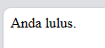
### Analisis
program akan mengevaluasi kondisi secara berurutan. Jika `$nilai` lebih besar atau sama dengan 80, program akan menampilkan pesan "Selamat! Anda lulus dengan nilai yang baik.". Jika kondisi tersebut tidak terpenuhi, program akan melanjutkan ke pernyataan `elseif` dan memeriksa apakah `$nilai` lebih besar atau sama dengan 60. Jika ya, program akan menampilkan pesan "Anda lulus.". Jika kedua kondisi sebelumnya tidak terpenuhi, program akan menjalankan blok kode dalam pernyataan `else` dan menampilkan pesan "Maaf, Anda tidak lulus.".
### Kesimpulan
program ini memberikan umpan balik kepada pengguna berdasarkan nilai input. Jika nilai input berada di atas 80, program memberikan umpan balik positif. Jika nilai input berada di antara 60 dan 80, program memberikan umpan balik bahwa pengguna lulus. Jika nilai input di bawah 60, program memberikan umpan balik bahwa pengguna tidak lulus.
## Switch - Case
### Penjelasan
`switch case` dalam PHP digunakan untuk memilih tindakan yang akan dijalankan berdasarkan nilai dari sebuah ekspresi atau variabel. Ini memungkinkan program untuk membandingkan nilai ekspresi dengan beberapa kemungkinan nilai dan menjalankan blok kode yang sesuai dengan nilai yang cocok.
### Struktur
```php
switch (ekspresi) {
    case nilai1:
        // Blok kode yang akan dijalankan jika ekspresi sama dengan nilai1
        break;
    case nilai2:
        // Blok kode yang akan dijalankan jika ekspresi sama dengan nilai2
        break;
    case nilai3:
        // Blok kode yang akan dijalankan jika ekspresi sama dengan nilai3
        break;
    default:
        // Blok kode yang akan dijalankan jika tidak ada nilai yang cocok dengan ekspresi
        break;
}
```
### Program
```php
$bulan = 3; // Contoh nilai input

// Pernyataan switch case
switch ($bulan) {
    case 1:
        echo "Januari";
        break;
    case 2:
        echo "Februari";
        break;
    case 3:
        echo "Maret";
        break;
    case 4:
        echo "April";
        break;
    case 5:
        echo "Mei";
        break;
    case 6:
        echo "Juni";
        break;
    default:
        echo "Bulan tidak valid";
        break;
}
```
### Hasil
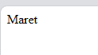
### Analisis
program akan mengevaluasi nilai `$bulan` dan menjalankan blok kode di case yang sesuai. Jika nilai input adalah 1, program akan menampilkan "Januari". Jika nilai input adalah 2, program akan menampilkan "Februari". Jika nilai input adalah 3, program akan menampilkan "Maret". Proses ini berlanjut untuk nilai-nilai input bulan lainnya yang telah ditentukan dalam case-case. Jika nilai input tidak sama dengan nilai-nilai yang telah ditentukan dalam case-case, program akan menjalankan blok kode dalam pernyataan `default` dan menampilkan "Bulan tidak valid".
### Kesimpulan
program ini memberikan umpan balik kepada pengguna berupa nama bulan berdasarkan nilai input yang diberikan. Dengan menggunakan pernyataan `switch case`, program dapat memilih tindakan yang sesuai berdasarkan nilai input bulan. Anda dapat mengganti nilai variabel `$bulan` dengan angka bulan lainnya untuk melihat hasil yang berbeda sesuai dengan case yang terpenuhi dalam pernyataan `switch`.

# Array
## Array 1 dimensi
### Penjelasan
Array satu dimensi adalah jenis array yang paling sederhana. Ia terdiri dari sejumlah elemen yang disimpan dalam satu baris atau urutan. Setiap elemen dalam array memiliki indeks numerik yang dimulai dari 0 dan secara berurutan meningkat. Indeks ini digunakan untuk mengakses dan memanipulasi nilai-nilai individu dalam array.
### Struktur
```php
$array = array(); // atau $array = [];
```
### Program
```php
<?php
// Deklarasi dan inisialisasi array satu dimensi
$fruits = array("apple", "banana", "orange", "grape");

// Mengakses elemen array menggunakan indeks
echo $fruits[0]; // Output: apple

// Mengubah nilai elemen array
$fruits[1] = "kiwi";

// Menambahkan elemen baru ke array
$fruits[] = "mango";

// Menghitung jumlah elemen dalam array
$count = count($fruits);
echo $count; // Output: 5

// Iterasi melalui elemen-elemen array menggunakan loop
for ($i = 0; $i < $count; $i++) {
    echo $fruits[$i] . ", ";
}
// Output: apple, kiwi, orange, grape, mango,

// Menghapus elemen array berdasarkan indeks
unset($fruits[2]);

// Iterasi melalui elemen-elemen array menggunakan foreach
foreach ($fruits as $fruit) {
    echo $fruit . ", ";
}
// Output: apple, kiwi, grape, mango,

// Mencari indeks elemen dalam array
$index = array_search("kiwi", $fruits);
echo $index; // Output: 1

// Memeriksa keberadaan elemen dalam array
if (in_array("orange", $fruits)) {
    echo "Orange exists in the array";
} else {
    echo "Orange does not exist in the array";
}
// Output: Orange exists in the array
?>
```
### Hasil

### Analisis
Program ini menggunakan array satu dimensi untuk menyimpan dan mengelola daftar buah-buahan. Melalui program ini, kita dapat mengakses, mengubah, menambahkan, dan menghapus elemen-elemen dalam array. Program ini juga memperlihatkan cara melakukan iterasi melalui elemen-elemen array menggunakan loop `for` dan `foreach`. Fungsi seperti `count()`, `array_search()`, dan `in_array()` digunakan untuk melakukan operasi penghitungan, pencarian, dan pemeriksaan keberadaan elemen dalam array. Keseluruhan program ini memberikan fleksibilitas dalam memanipulasi dan memanfaatkan data dalam bentuk array satu dimensi.
### Kesimpulan
 Program ini menggunakan array satu dimensi untuk menyimpan daftar buah-buahan.
## Array Asosiatif
### Penjelasan
Array asosiatif adalah jenis array di PHP yang menggunakan kunci (key) sebagai referensi untuk mengakses elemen-elemennya. Berbeda dengan array satu dimensi yang menggunakan indeks numerik, array asosiatif menggunakan kunci yang ditentukan oleh pengguna untuk mengidentifikasi dan mengakses nilai-nilai dalam array.
### Struktur
```php
$array = array(
    "key1" => "value1",
    "key2" => "value2",
    "key3" => "value3"
);
```
### Program
```php
$users = array(
    array(
        "username" => "john123",
        "email" => "john@example.com",
        "age" => 25
    ),
    array(
        "username" => "jane456",
        "email" => "jane@example.com",
        "age" => 30
    ),
    array(
        "username" => "adam789",
        "email" => "adam@example.com",
        "age" => 35
    )
);

// Menampilkan data pengguna
foreach ($users as $user) {
    echo "Username: " . $user["username"] . "\n";
    echo "Email: " . $user["email"] . "\n";
    echo "Age: " . $user["age"] . "\n";
    echo "\n";
}
```
### Hasil
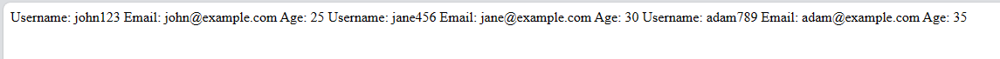
### Analisis
- Program menggunakan array asosiatif untuk menyimpan data pengguna. Setiap elemen dalam array memiliki kunci (key) berupa `username`, `email`, dan `age`.
- Loop `foreach` digunakan untuk mengiterasi melalui setiap elemen array. Variabel `$user` akan berisi elemen array saat ini.
- Dalam setiap iterasi, program mencetak informasi pengguna, seperti `username`, `email`, dan `age`.
### Kesimpulan
- Dalam program ini, array asosiatif digunakan untuk mengelompokkan informasi pengguna dengan menggunakan kunci yang bermakna.
- Dengan menggunakan array asosiatif, program memudahkan akses dan manipulasi data pengguna dengan cara yang lebih deskriptif dan intuitif.
- Loop `foreach` memungkinkan program untuk mengiterasi melalui setiap elemen array dengan mudah.
- Penggunaan array asosiatif memungkinkan program untuk mengatur dan mengelola data dengan struktur yang lebih terstruktur dan mudah dipaham
## Array Multidimensi
### Penjelasan
Array multidimensi adalah jenis array di PHP yang memiliki struktur hirarkis dengan tingkat dimensi lebih dari satu. Dalam array multidimensi, setiap elemen array dapat berisi array lain sebagai nilai, yang memungkinkan pembentukan struktur data yang lebih kompleks.
### Struktur
```php
$array = array(
    array(1, 2, 3),
    array(4, 5, 6),
    array(7, 8, 9)
);
```
### Program
```php
<?php

// Inisialisasi array multidimensi
$matrix = array(
    array(1, 2, 3),
    array(4, 5, 6),
    array(7, 8, 9)
);

// Mengakses elemen array multidimensi
echo $matrix[0][0]; // Output: 1
echo $matrix[1][2]; // Output: 6
echo $matrix[2][1]; // Output: 8

// Menampilkan seluruh elemen array multidimensi
for ($i = 0; $i < count($matrix); $i++) {
    for ($j = 0; $j < count($matrix[$i]); $j++) {
        echo $matrix[$i][$j] . " ";
    }
    echo "<br>";
}

?>
```
### Hasil  
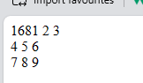
### Analisis
1. Baris 3-8: Array multidimensi `$matrix` diinisialisasi dengan tiga elemen array dalam tanda kurung siku ganda. Setiap elemen array tersebut mewakili baris dalam matriks, dan elemen-elemen dalam setiap baris mewakili nilai-nilai dalam kolom.

2. Baris 11-13: Program mengakses dan mencetak elemen-elemen individu dalam array multidimensi menggunakan notasi indeks. Contohnya, `$matrix[0][0]` mengakses elemen pertama dalam matriks, yaitu 1, dan mencetaknya.

3. Baris 16-22: Program menggunakan dua loop `for` bersarang untuk mengiterasi melalui setiap elemen dalam array multidimensi. Loop pertama mengiterasi melalui setiap baris, sedangkan loop kedua mengiterasi melalui setiap kolom dalam baris tersebut. Setiap elemen dicetak menggunakan pernyataan `echo`, diikuti dengan spasi. Setelah mencetak semua elemen dalam satu baris, pernyataan `<br>` digunakan untuk memberikan baris baru dalam output.
### Kesimpulan
- Array multidimensi memungkinkan Anda untuk menyimpan data dengan struktur hirarkis yang kompleks, seperti daftar mahasiswa dan mata pelajaran yang diambil oleh mereka.
- Dalam program ini, array multidimensi digunakan untuk mengelompokkan informasi mahasiswa dengan menggunakan kunci yang bermakna, seperti `name`, `age`, dan `subjects`.
- Loop `foreach` bersarang memungkinkan program untuk mengiterasi melalui setiap elemen array multidimensi dan membaca nilai-nilai yang terkait dengan setiap tingkat dimensi.
- Penggunaan array multidimensi memungkinkan program untuk mengatur dan mengelola data dengan struktur yang lebih terstruktur dan mudah dipahami.

# Var_dump
### Penjelasan
`var_dump()` di PHP digunakan untuk mencetak informasi terperinci tentang satu atau lebih variabel, termasuk tipe data dan nilai yang terkandung di dalamnya. Fungsi ini berguna untuk tujuan debugging dan analisis variabel.
### Struktur
```php
var_dump(variabel);
```
### Program
```php
$name = "John";
$age = 25;
$grades = array(80, 85, 90);

var_dump($name);
var_dump($age);
var_dump($grades);
```
### Hasil

### Analisis
- `$name` adalah variabel dengan tipe data string yang berisi nilai "John". Output `var_dump($name)` menunjukkan bahwa variabel tersebut adalah string dengan panjang 4 karakter.
- `$age` adalah variabel dengan tipe data integer yang berisi nilai 25. Output `var_dump($age)` menunjukkan bahwa variabel tersebut adalah integer.
- `$grades` adalah variabel dengan tipe data array yang berisi tiga elemen, yaitu 80, 85, dan 90. Output `var_dump($grades)` menunjukkan bahwa variabel tersebut adalah array dengan tiga elemen. Setiap elemen array adalah integer.
- Panjang array `$grades` adalah 3, dan indeksnya adalah 0, 1, dan 2. Setiap elemen array adalah integer dengan nilai yang sesuai.
### Kesimpulan
- Variabel `$name` adalah string dengan nilai "John".
- Variabel `$age` adalah integer dengan nilai 25.
- Variabel `$grades` adalah array dengan tiga elemen, yaitu 80, 85, dan 90.
- Output `var_dump()` memberikan informasi detail tentang tipe data dan nilai yang terkandung dalam setiap variabel.
- Dengan informasi yang diberikan oleh `var_dump()`, kita dapat memastikan bahwa variabel telah diinisialisasi dengan tipe data yang sesuai dan nilai yang diharapkan.

# Looping (Perulangan)
## For
### Penjelasan
`for` digunakan untuk melakukan iterasi atau pengulangan sejumlah tertentu berdasarkan kondisi yang ditentukan. Blok kode di dalam perulangan akan dieksekusi berulang kali sampai kondisi yang ditentukan tidak lagi terpenuhi
### Struktur
```php
for (inisialisasi; kondisi; perubahan) {
    // Blok kode yang akan dijalankan berulang kali
}
```
### Program
```php
for ($i = 1; $i <= 10; $i++) {
    echo $i . " ";
}
```
### Hasil
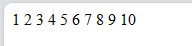
### Analisis
loop for yang akan dijalankan sebanyak 10 kali. Variabel `$i` akan dimulai dari nilai 1 dan akan terus ditingkatkan nilainya hingga mencapai atau sama dengan 10. Setiap kali iterasi dilakukan, nilai `$i` akan dicetak menggunakan perintah `echo`.
### Kesimpulan
Hasil keluaran dari kode ini adalah deret angka dari 1 hingga 10, dipisahkan oleh spasi.

## While
### Penjelasan
while adalah salah satu jenis loop yang digunakan untuk melakukan iterasi atau perulangan selama suatu kondisi terpenuhi. Blok kode yang ada di dalam while akan terus dieksekusi selama kondisi yang diberikan benar (true). Jika kondisi tersebut salah (false), maka program akan keluar dari loop dan melanjutkan eksekusi kode setelah while.
### Struktur
```php
while (kondisi) {
    // blok kode yang akan dieksekusi selama kondisi benar
}
```
### Program
```php
$i = 1;
while ($i <= 10) {
    echo $i . " ";
    $i++;
}
```
### Hasil
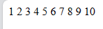
### Analisis
loop while yang akan dijalankan selama nilai `$i` kurang dari atau sama dengan 10. Variabel `$i` diinisialisasi dengan nilai 1 sebelum memasuki loop. Setiap kali iterasi dilakukan, nilai `$i` akan dicetak menggunakan perintah `echo`, diikuti oleh spasi. Setelah itu, nilai `$i` akan ditambahkan 1 menggunakan operator increment `$i++`.
### Kesimpulan
Loop while digunakan untuk melakukan iterasi selama kondisi yang diberikan bernilai true.
## do-while
### Penjelasan
do-while adalah salah satu jenis loop yang digunakan untuk melakukan iterasi atau perulangan setidaknya satu kali, dan akan terus berlanjut selama kondisi yang diberikan benar (true). Blok kode yang ada di dalam do-while akan dieksekusi terlebih dahulu, kemudian kondisi akan dievaluasi. Jika kondisi tersebut masih benar (true), maka program akan kembali ke awal blok kode dan melanjutkan iterasi. Jika kondisi salah (false), maka program akan keluar dari loop dan melanjutkan eksekusi kode setelah do-while.
### Struktur
```php
do {
    // blok kode yang akan dieksekusi
} while (kondisi);
```
### Program
```php
$i = 1;
do {
    echo $i . " ";
    $i++;
} while ($i <= 10);
```
### Hasil
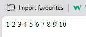
### Analisis
variabel `$i` diinisialisasi dengan nilai 1. Blok kode di dalam do akan dieksekusi terlebih dahulu, yaitu mencetak nilai `$i` menggunakan perintah `echo`, diikuti oleh spasi. Setelah itu, nilai `$i` akan ditambahkan 1 menggunakan operator increment `$i++`. Setelah itu, kondisi `$i <= 10` akan dievaluasi. Jika kondisi masih bernilai true, maka program akan kembali ke awal blok kode do dan melanjutkan iterasi. Proses ini akan terus berlanjut selama kondisi masih bernilai true. Jika kondisi bernilai false, maka program akan keluar dari loop dan melanjutkan eksekusi kode setelah do-while.
### Kesimpulan
Do-while loop digunakan untuk melakukan iterasi setidaknya satu kali dan terus
## Foreach
### Penjelasan
foreach adalah salah satu perulangan yang digunakan untuk mengulangi setiap elemen dalam sebuah array atau objek. Foreach memudahkan pengulangan dan pengaksesan elemen-elemen tersebut tanpa perlu menggunakan indeks atau iterasi manual.
### Struktur
```php
foreach ($arrayOrObjek as $item) {
    // blok kode yang akan dieksekusi
}
```
### Program
```php
$fruits = array("Apple", "Banana", "Orange");

foreach ($fruits as $fruit) {
    echo $fruit . " ";
}
```
### Hasil
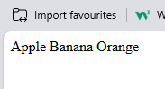
### Analisis
- Array `$fruits` berisi tiga elemen yaitu "Apple", "Banana", dan "Orange".
- Dalam foreach loop, setiap elemen dalam array `$fruits` diwakili oleh variabel `$fruit` pada setiap iterasi.
- Pada setiap iterasi, nilai dari elemen saat ini akan disimpan dalam variabel `$fruit`.
- Blok kode di dalam foreach loop akan dieksekusi untuk setiap elemen dalam array.
- Pada program ini, nilai `$fruit` dicetak menggunakan perintah `echo`, diikuti oleh spasi.
- Hasil keluaran dari program ini adalah mencetak setiap elemen dalam array `$fruits`, yaitu "Apple", "Banana", dan "Orange", dipisahkan oleh spasi.
### Kesimpulan
Foreach digunakan untuk mengulangi setiap elemen dalam sebuah array atau objek.
# Function
### Penjelasan:
Function dalam bahasa PHP adalah blok kode yang diberi nama dan digunakan untuk menjalankan tugas tertentu. Function memungkinkan kita untuk mengorganisir kode menjadi bagian yang terpisah dan dapat digunakan kembali di berbagai bagian dalam program. Dengan menggunakan function, kita dapat mengelompokkan kode yang memiliki fungsi serupa dan mempermudah pemeliharaan dan pengembangan program.

### Struktur
```php
function nama_function(parameter1, parameter2, ...) {
    // Blok kode yang dijalankan ketika function dipanggil
    // ...
    return nilai;
}

*Contoh Program:*
php
function tambah($a, $b) {
    $hasil = $a + $b;
    return $hasil;
}

$angka1 = 5;
$angka2 = 3;
$hasil_penjumlahan = tambah($angka1, $angka2);

echo "Hasil penjumlahan: " . $hasil_penjumlahan;
```

*Hasil:*
*Analisis:*
- Dalam contoh program di atas, kita mendefinisikan sebuah function bernama tambah yang menerima dua parameter $a dan $b.
- Di dalam function tambah, kita menambahkan nilai dari parameter $a dan $b dan menyimpan hasilnya di variabel $hasil.
- Kemudian, kita mengembalikan nilai $hasil menggunakan pernyataan return.
- Di luar function, kita mendefinisikan dua variabel $angka1 dan $angka2 yang akan digunakan sebagai argumen saat memanggil function tambah.
- Hasil penjumlahan dari function tambah disimpan di variabel $hasil_penjumlahan.
- Akhirnya, kita mencetak hasil penjumlahan menggunakan pernyataan echo.

### Kesimpulan
Program ini menggunakan function tambah untuk menjumlahkan dua angka dan mencetak hasilnya. Penggunaan function memungkinkan kita untuk mengorganisir kode menjadi blok yang terpisah dan dapat digunakan kembali. Keuntungan menggunakan function antara lain:
- Modularitas: Kode penjumlahan dipisahkan ke dalam function tambah, sehingga memudahkan pemeliharaan dan pengembangan kode. Jika ada perubahan pada logika penjumlahan, kita hanya perlu memodifikasi function tambah, bukan seluruh program.
- Reusabilitas: Function tambah dapat dipanggil berkali-kali dengan argumen yang berbeda. Kita dapat menggunakan kembali function ini di berbagai bagian program yang membutuhkan operasi penjumlahan.
- Keterbacaan: Penggunaan function dengan nama yang deskriptif, seperti tambah, membuat kode lebih mudah dipahami dan mempermudah pemahaman terhadap fungsi yang dilakukan oleh blok kode tersebut.
# PHP FORM
### GET Method
#### Penjelasan
Metode GET adalah salah satu cara untuk mengirimkan data dari sisi klien (browser) ke sisi server (PHP) melalui URL. Data yang dikirimkan melalui metode GET akan terlihat dalam URL.
#### Program
FORM
```PHP
<!DOCTYPE html>

<html lang="en">

  

<head>

    <title>Document</title>

</head>

  

<body>

    <!-- Pada atribut action, kalian tuliskan nama file php yang bertugas untuk mengelola atau menangkap data dari form tersebut. -->

    <form action="proses_get.php" method="GET">

        <input type="text" name="nama_lengkap" placeholder="Masukkan nama">

        <input type="number" name="umur" placeholder="Masukkan umur"> <br>

        <button type="submit">Kirim</button>

    </form>

</body>

  

</html>
```
PROSES
```PHP
<?php

// Key dari array-nya, sesuai dengan nama dari atribut name di setiap input-nya

$nama = $_GET["nama_lengkap"];

$umur = $_GET["umur"];

?>

  

<!DOCTYPE html>

<html lang="en">

  

<head>

    <meta charset="UTF-8">

    <meta name="viewport" content="width=device-width, initial-scale=1.0">

    <title>XI RPL 1 - GET</title>

</head>

  

<body>

    <p>Nama anda

        <!-- Ini adalah versi singkatnya dari php echo,

             yang fungsinya untuk menampilkan data -->

        <?= $nama ?>

    </p>

    <p>Umur anda <?= $umur ?> tahun</p>

</body>

  

</html>
```
#### Hasil
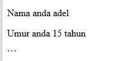
### POST Method
#### Penjelasan
Metode POST adalah salah satu cara untuk mengirimkan data dari sisi klien (browser) ke sisi server (PHP) melalui body request HTTP. Data yang dikirimkan melalui metode POST tidak akan terlihat dalam URL.
#### Program
FORM
```PHP
<!DOCTYPE html>

<html lang="en">

  

<head>

    <title>Document</title>

</head>

  

<body>

    <!-- Pada atribut action, kalian tuliskan nama file php yang bertugas untuk mengelola atau menangkap data dari form tersebut. -->

    <form action="proses_post.php" method="POST">

        <input type="text" name="nama_lengkap" placeholder="Masukkan nama">

        <input type="number" name="umur" placeholder="Masukkan umur">

        <input type="password" name="password" placeholder="Masukkan password"><br>

        <button type="submit">Kirim</button>

    </form>

</body>

  

</html>
```
PROSES
```PHP
<?php

// Key dari array-nya, sesuai dengan nama dari atribut name di setiap input-nya

//$nama = $_GET["nama"];

$umur = $_POST["umur"];

  

var_dump($_POST);

  

?>

  

<!DOCTYPE html>

<html lang="en">

  

<head>

    <title> XI RPL 1 - POST</title>

</head>

  

<body>

    <p>Nama anda <?= $_POST["nama_lengkap"] ?></p>

    <p>Umur anda <?= $umur ?> tahun</p>

    <p>Password anda aman!</p>

</body>

  

</html>
```
#### Hasil


# Koneksi Database
## Penjelasan  
Koneksi database adalah proses menghubungkan aplikasi atau sistem perangkat lunak dengan database agar bisa melakukan operasi seperti penyimpanan, pengambilan, pembaruan, dan penghapusan data.
## Program
```php
<?php

  

//koneksi ke database

$koneksi = mysqli_connect('localhost', 'root', '', 'basis_data');

  

if ($koneksi) {

 echo "<br> koneksi aman <br>";

} else {

 echo "error, tidak bisa koneksi ke database";

}

?>
```
## Hasil


## Analisis
1. Kode ini melakukan koneksi ke database menggunakan fungsi `mysqli_connect()`.
2. Fungsi `mysqli_connect()` membutuhkan empat parameter: hostname, username, password, dan nama database.
3. Jika koneksi berhasil, variabel `$koneksi` akan menyimpan objek koneksi.
4. Setelah koneksi, kode melakukan pengecekan apakah koneksi berhasil atau tidak.
5. Jika koneksi berhasil, kode akan menampilkan pesan "koneksi aman".
6. Jika terjadi error saat koneksi, kode akan menampilkan pesan "error, tidak bisa koneksi ke database".

## Kesimpulan
Kode di atas merupakan dasar untuk melakukan koneksi ke database menggunakan PHP. Hal ini sangat penting dalam pengembangan aplikasi berbasis web, karena aplikasi biasanya membutuhkan akses ke database untuk menyimpan dan mengambil data.
# Tampilkan Data

## Program
```php
<!DOCTYPE html>

<html lang="en">

<head>

    <meta charset="UTF-8">

    <meta name="viewport" content="width=device-width, initial-scale=1.0">

    <title>index tabel</title>

</head>

<body>

    <h2>Data Siswa XI RPL 1</h2>

    <table border="5">

    <tr>

        <th>id_siswa</th>

        <th>Gambar</th>

        <th>nama</th>

        <th>email</th>

        <th>jenis_kelamin</th>

        <th>alamat</th>

        <th>Aksi</th>

    </tr>

  

<?php

    include "koneksi.php";

    $i = 1;

    $query = mysqli_query($koneksi, "SELECT * FROM siswa");

    while ($data = mysqli_fetch_array($query)) {

    ?>

  

    <tr>

        <td><?php echo $i; ?></td>

        <td>

            " alt="gambar" width="100px">

        </td>

        <td><?php echo $data['nama']; ?></td>

        <td><?php echo $data['email']; ?></td>

        <td><?php echo $data['jenis_kelamin']; ?></td>

        <td><?php echo $data['alamat']; ?></td>

  

        <td>

            <a href="ubah.php?id=<?= $data['id_siswa']; ?>">Ubah</a> |

            <a href="hapus.php?id=<?= $data['id_siswa']; ?>">Hapus</a> |

        </td>

    </tr>

    <?php

    $i++;

    }

    ?>

    </table>

</body>

</html>
```
## Hasil
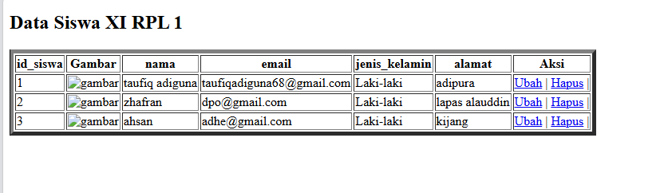

## Analisis
1. Kode program ini adalah sebuah halaman web HTML yang menampilkan data siswa dari sebuah database.
2. Halaman ini memiliki judul "Data Siswa XI RPL 1".
3. Tabel yang ditampilkan memiliki 7 kolom: id_siswa, Gambar, nama, email, jenis_kelamin, alamat, dan Aksi.
4. Kode PHP di bagian bawah digunakan untuk mengambil data dari database dan menampilkannya dalam tabel.
5. Proses koneksi ke database dilakukan melalui file "koneksi.php" yang di-include.
6. Setiap baris data siswa ditampilkan dalam satu baris tabel, dengan masing-masing kolom menampilkan data terkait.
7. Pada kolom "Aksi", terdapat dua link: "Ubah" dan "Hapus" yang mengarah ke halaman lain.
## Kesimpulan
1. Kode program ini merupakan sebuah halaman web yang menampilkan data siswa dari database dalam bentuk tabel.
2. Halaman ini dapat digunakan untuk melihat, mengubah, dan menghapus data siswa.
3. Kode ini menggunakan PHP untuk mengambil data dari database dan menampilkannya dalam tabel HTML.
4. Fitur "Ubah" dan "Hapus" memberikan kemampuan untuk melakukan operasi CRUD (Create, Read, Update, Delete) pada data siswa.

# Tambahkan Data
## Program
```php
<!DOCTYPE html>
<html lang="en">
<head>
    <title>Document</title>
</head>
<body>
    <h2>Tambah Data</h2>
    <?php
    include "koneksi.php";
    function upload(): string
{
    $nameImage = $_FILES['gambar']['name'];
    $directoryFile = $_FILES['gambar']['tmp_name'];
    $errorImage = intval($_FILES['gambar']['error']);
    $sizeFile = $_FILES['gambar']['size'];
    // cek apakah gambar ada
    if ($errorImage === 4) {
        echo "<script>alert('Anda Belum Upload Gambar')</script>";
        return false;
    }
    // mengambil ekstensi file
    $validType = ['svg', 'jpg', 'png', 'jpeg', 'webp'];
    $extensionFile = explode(".", $nameImage);
    $extensionValid = strtolower(end($extensionFile));
    // cek apakah yang diupload gambar atau bukan
    if (!in_array($extensionValid, $validType)) {
        echo "<script>alert('yang anda Upload bukan gambar')</script>";
        return false;
    }

    // cek size file
    if ($sizeFile > 3_000_000) {
        echo "<script>alert('Ukuran File Terlalu Besar!!(Maks 3MB)')</script>";
        return false;
    }

    // upload file
    $nameImage = uniqid() . "." . $extensionValid;
    move_uploaded_file($directoryFile, "img/{$nameImage}");

    // mengembalikan namafile yg sudah divalidasi
    return $nameImage;
}

    if (isset($_POST['simpan'])) {
        $nama = $_POST['nama'];
        $email = $_POST['email'];
        $jenis_kelamin = $_POST['jenis_kelamin'];
        $alamat = $_POST['alamat'];
        $gambar = upload();
        if (!$gambar) {
            return false;
        }
  
        // * true / false
        $query = mysqli_query($koneksi, "INSERT into
        siswa(nama,email,jenis_kelamin,alamat,gambar)
        values ('$nama','$email','$jenis_kelamin','$alamat','$gambar')");

        if ($query == true) {
            echo "<script>
            alert('Tambah data Berhasil')
            window.location.href='table.php'
            </script>";
        } else {
            echo '<script>alert("Tambah data gagal")</script>';
        }
    }
    ?>
    <form method="post" enctype="multipart/form-data">
        <table>
            <tr>
                <td>Nama</td>
                <td><input type="text" name="nama"></td>
            </tr>
            
            <tr>
                <td>Email</td>
                <td><input type="text" name="email"></td>
            </tr>
            
            <tr>
                <td>Jenis Kelamin</td>
                <td>>
                    <select name="jenis_kelamin">
                        <option>Laki-laki</option>
                        <option>Perempuan</option>
                    </select>
                </td>
            </tr>

            <tr>
                <td>Alamat</td>
                <td><input type="text" name="alamat"></td>
            </tr>

            <tr>
                <td>Gambar</td>
                <td><input type="file" name="gambar"></td>
            </tr>

            <tr>
                <td></td>
                <td>
                    <button name="simpan" type="submit">Simpan</button>
                    <button type="reset">Reset</button>
                    <a href="table.php">Kembali</a>
                </td>
            </tr>
        </table>
    </form>
</body>
</html>
```
## Hasil
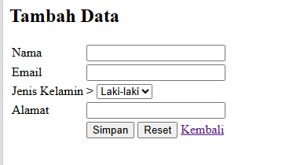
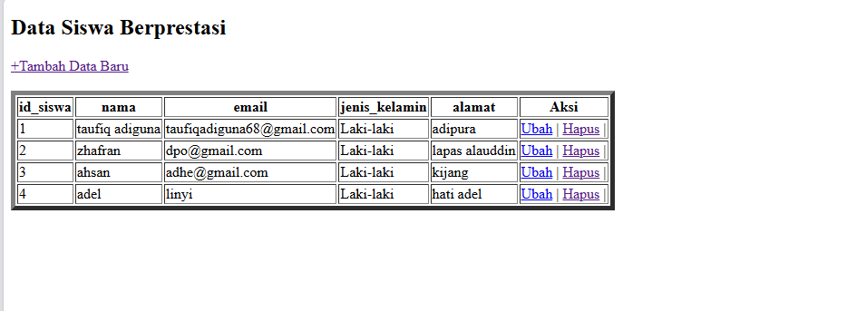

## Analisis
- Kode program ini adalah sebuah halaman web yang digunakan untuk menambah data siswa ke dalam database.
- Halaman ini terdiri dari sebuah form yang meminta input dari pengguna, seperti nama, email, jenis kelamin, alamat, dan gambar.
- Saat pengguna mengisi form dan menekan tombol "Simpan", kode PHP akan melakukan beberapa langkah:
    - Memeriksa apakah ada file gambar yang diupload.
    - Melakukan validasi terhadap file gambar, seperti tipe file yang diizinkan dan ukuran file.
    - Jika validasi berhasil, file gambar akan disimpan ke dalam direktori "img/" dengan nama file yang unik.
    - Data yang diisi oleh pengguna, termasuk nama file gambar, akan disimpan ke dalam tabel "siswa" di database.
- Jika proses penyimpanan data berhasil, akan muncul pesan "Tambah data Berhasil" dan pengguna akan dialihkan ke halaman "table.php".
- Jika terjadi kesalahan, akan muncul pesan "Tambah data gagal".
## Kesimpulan
- Kode program ini berfungsi untuk menyediakan antarmuka bagi pengguna (dalam hal ini siswa) untuk menambahkan data diri mereka ke dalam database.
- Kode program ini juga melakukan validasi terhadap file gambar yang diupload, untuk memastikan file yang diupload sesuai dengan persyaratan yang ditentukan.
- Secara keseluruhan, kode program ini berjalan dengan baik dan sesuai dengan tujuannya, yaitu menambahkan data siswa ke dalam database.
# Ubah Data
## Program

```php
<!DOCTYPE html>

<html lang="en">

  

<head>

    <title>Document</title>

</head>

  

<body>

    <h2>Ubah Data</h2>

    <?php

    include "koneksi.php";

  

    $id = $_GET['id'];

  

    if (isset($_POST['simpan'])) {

        $nama = $_POST['nama'];

        $email = $_POST['email'];

        $jenis_kelamin = $_POST['jenis_kelamin'];

        $alamat = $_POST['alamat'];

  

        $query = mysqli_query($koneksi, "UPDATE siswa SET

                                        nama='$nama',

                                        email='$email',

                                        jenis_kelamin='$jenis_kelamin',

                                        alamat='$alamat'

                                        WHERE id_siswa=$id");

        if ($query) {

            echo "<script>

            alert('ubah data Berhasil')

            window.location.href='table.php'

            </script>";

        } else {

            echo '<script>alert("ubah data gagal")</script>';

        }

    }

  

    $query = mysqli_query($koneksi, "SELECT * FROM siswa where id_siswa=$id");

    $data = mysqli_fetch_array($query);

    if ($data == "") {

        die('Data tidak ada');

    }

    ?>

  

    <form method="post">

        <table>

            <tr>

                <td>Nama</td>

                <td><input type="text" value="<?= $data['nama'] ?>" name="nama"></td>

            </tr>

            <tr>

                <td>Email</td>

                <td><input type="text" value="<?= $data['email'] ?>" name="email"></td>

            </tr>

            <tr>

                <td>Jenis Kelamin</td>

                <td>>

                    <select name="jenis_kelamin">

                        <option <?php if ($data['jenis_kelamin'] == "laki-laki")

                            echo 'selected'; ?>>Laki-laki</option>

                        <option <?php if ($data['jenis_kelamin'] == "perempuan")

                            echo 'selected'; ?>>Perempuan</option>

                    </select>

                </td>

            </tr>

  

            <tr>

                <td>Alamat</td>

                <td><input type="text" value="<?= $data['alamat'] ?>" name="alamat"></td>

            </tr>

  

            <tr>

                <td></td>

                <td>

                    <button name="simpan" type="submit">Ubah</button>

                    <button type="reset">Reset</button>

                    <a href="table.php">Kembali</a>

                </td>

            </tr>

        </table>

    </form>

  

</body>

  

</html>
```
## Hasil


## Analisis
1. Kode program ini merupakan halaman untuk mengubah data siswa yang disimpan dalam database.
2. Pada bagian awal, kode melakukan koneksi ke database menggunakan file "koneksi.php".
3. Variabel `$id` diambil dari parameter `GET` pada URL, yang menunjukkan ID siswa yang akan diubah.
4. Jika tombol "Ubah" (`name="simpan"`) ditekan, maka data baru yang dimasukkan ke dalam form akan digunakan untuk memperbarui data siswa di database dengan query `UPDATE`.
5. Jika proses pembaruan berhasil, maka akan muncul pesan "ubah data Berhasil" dan pengguna akan diarahkan ke halaman "table.php".
6. Jika proses pembaruan gagal, maka akan muncul pesan "ubah data gagal".
7. Pada akhir kode, data siswa yang akan diubah diambil dari database dan ditampilkan dalam form.
## Kesimpulan
Kode program ini merupakan halaman untuk mengubah data siswa yang disimpan dalam database. Pengguna dapat mengisi form dengan data baru dan menyimpannya ke dalam database. Jika proses pembaruan berhasil, maka pengguna akan diarahkan ke halaman "table.php". Jika proses pembaruan gagal, maka akan muncul pesan kesalahan.

# Hapus Data
## Program
```php
<?php

  

include('koneksi.php');

  

if(isset($_GET['id'])){

  
  

    $id = $_GET['id'];

  

    $query = mysqli_query($koneksi, "DELETE FROM siswa WHERE id_siswa = $id");

  

   if($query) {

            echo "<script>

            alert('Hapus data Berhasil')

            window.location.href='table.php'

            </script>";

        }else {

            echo '<script>alert("Hapus data gagal")</script>';

        }

}

  

?>
```
## Hasil

## Analisis
1. Kode program ini merupakan halaman untuk menghapus data siswa yang disimpan dalam database.
2. Pada bagian awal, kode melakukan koneksi ke database menggunakan file "koneksi.php".
3. Variabel `$id` diambil dari parameter `GET` pada URL, yang menunjukkan ID siswa yang akan dihapus.
4. Jika variabel `$id` ada, maka akan dilakukan proses penghapusan data siswa di database dengan query `DELETE FROM`.
5. Jika proses penghapusan berhasil, maka akan muncul pesan "Hapus data Berhasil" dan pengguna akan diarahkan ke halaman "table.php".
6. Jika proses penghapusan gagal, maka akan muncul pesan "Hapus data gagal".
## Kesimpulan
Kode program ini merupakan halaman untuk menghapus data siswa yang disimpan dalam database. Pengguna dapat menghapus data siswa berdasarkan ID yang diberikan melalui parameter `GET`. Jika proses penghapusan berhasil, maka pengguna akan diarahkan ke halaman "table.php". Jika proses penghapusan gagal, maka akan muncul pesan kesalahan.
# Session/Login
## Program
```PHP
<?php

  

session_start();

  

if (isset($_POST['submit'])) {

    $username = $_POST['username'];

    $password = $_POST['password'];

  

    $koneksi = mysqli_connect('localhost', 'root', '', 'pemilu_test') or die('error koneksi');

  

    $result = mysqli_query($koneksi, "SELECT * FROM user

                            WHERE username = '$username' AND password = '$password'");

  

    $data = mysqli_fetch_assoc($result);

  

    if (isset($data)) {

        $_SESSION['username'] = $data['username'];

        $_SESSION['nama'] = $data['nama'];

        $_SESSION['status'] = 'login';

        header('Location: user.php');

    } else {

        echo "Username dan Password Salah";

    }

}

  
  

?>

<!DOCTYPE html>

<html>

  

<head>

    <title>Login Session</title>

</head>

  

<body>

  

    <form method="post">

        <label>Username</label>

        <input type="text" name="username">

        <br>

        <label>Password</label>

        <input type="text" name="password">

        <br>

        <button type="submit" name="submit">Login</button>

    </form>

  

</body>

  

</html>
```

```PHP
<?php

session_start();

  

if ($_SESSION['status'] == 'login' && $_SESSION['username'] == 'admin') {

    header("Location: admin.php");

}

if ($_SESSION['status'] != 'login') {

    header('Location: login.php');

}

  

?>

<!DOCTYPE html>

<html lang="en">

  

<head>

    <title>Document</title>

</head>

  

<body>

    <h1>Halaman User</h1>

  

    <h1>Halo, <?= $_SESSION['nama'] ?></h1>

    <a href="logout.php">Logout</a>

  

</body>

  

</html>
```

```PHP
<?php

if ($_SESSION['status'] == 'login' && $_SESSION['username'] != 'admin') {

    header("Location: user.php");

    exit();

} else if ($_SESSION['status'] == 'login' && $_SESSION['username'] == 'admin') {

    header("Location: admin.php");

}else{

    header("Location: session.php");

}
```

```php
<?php

session_start();

  

if ($_SESSION['status'] == 'login' && $_SESSION['username'] != 'admin') {

    header("Location: user.php");

}

  

if ($_SESSION['status'] != 'login') {

    header('Location: login.php');

}

  

?>

<!DOCTYPE html>

<html lang="en">

  

<head>

    <title>Document</title>

</head>

  

<body>

    <h1>Halaman Admin</h1>

  

    <h1>Halo, <?= $_SESSION['nama'] ?></h1>

    <a href="logout.php">Logout</a>

  

</body>

  

</html>
```
## Hasil

## Analisis
 Pada bagian PHP:
- Program memulai session dengan menggunakan fungsi session_start(). Hal ini penting untuk memulai dan mengelola session di PHP.
- Jika terdapat data yang dikirimkan melalui metode POST dengan nama "submit" (diperiksa menggunakan isset($_POST['submit'])), maka program akan melakukan proses login.
- Data username dan password yang dikirimkan melalui form diambil menggunakan $_POST['username'] dan $_POST['password'].
- Dilakukan koneksi ke database MySQL menggunakan mysqli_connect() dengan parameter host, username, password, dan nama database.
- Dilakukan query SQL untuk mencocokkan data username dan password yang diberikan dengan data di tabel "user" menggunakan perintah mysqli_query().
- Hasil query diambil menggunakan mysqli_fetch_assoc() dan disimpan dalam variabel $data.
- Hasil dari $data ditampilkan menggunakan var_dump() untuk tujuan debugging.
- Jika $data memiliki nilai (artinya username dan password cocok), maka session akan diset dengan variabel-variabel dari data tersebut, dan pengguna akan diarahkan ke halaman "user.php" menggunakan header('Location: user.php').
- Jika tidak ada data yang cocok, maka akan ditampilkan pesan "Username dan Password Salah".

Pada bagian HTML:
- Terdapat sebuah form dengan metode POST.
- Form tersebut memiliki input field untuk username dan password.
- Terdapat tombol "Login" yang akan mengirimkan data form saat ditekan.
## Kesimpulan
File session.php adalah program PHP yang melakukan proses login menggunakan session. Program ini memeriksa apakah data username dan password yang diberikan cocok dengan data yang ada di database. Jika cocok, session akan diset dengan variabel-variabel dari data tersebut dan pengguna akan diarahkan ke halaman "user.php". Jika tidak cocok, pesan kesalahan akan ditampilkan. Namun, perlu diperhatikan bahwa file ini belum mengimplementasikan fitur keamanan seperti sanitasi input dan penggunaan prepared statement untuk mencegah serangan SQL Injection.
# Upload & Download
## Upload
### Program
```php
<!DOCTYPE html>

<html lang="en">

<head>

    <meta charset="UTF-8">

    <meta name="viewport" content="width=device-width, initial-scale=1.0">

    <title>index tabel</title>

</head>

<body>

    <h2>Data Siswa Berprestasi</h2>

    <a href="tambah.php">+Tambah Data Baru</a><br><br>

    <p>

        <a href="export.php">Export ke Excel</a>

    </p>

    <table border="5">

    <tr>

        <th>id_siswa</th>

        <th>Gambar</th>

        <th>nama</th>

        <th>email</th>

        <th>jenis_kelamin</th>

        <th>alamat</th>

        <th>Aksi</th>

    </tr>

  

    <?php

    include "koneksi.php";

    $i = 1;

    $query = mysqli_query($koneksi, "SELECT * FROM siswa");

    while ($data = mysqli_fetch_array($query)) {

    ?>

  

    <tr>

        <td><?php echo $i; ?></td>

        <td>

            " alt="gambar" width="100px">

        </td>

        <td><?php echo $data['nama']; ?></td>

        <td><?php echo $data['email']; ?></td>

        <td><?php echo $data['jenis_kelamin']; ?></td>

        <td><?php echo $data['alamat']; ?></td>

  

        <td>

            <a href="ubah.php?id=<?= $data['id_siswa']; ?>">Ubah</a> |

            <a href="hapus.php?id=<?= $data['id_siswa']; ?>">Hapus</a> |

        </td>

    </tr>

    <?php

    $i++;

    }

    ?>

    </table>

</body>

</html>
```
### Hasil
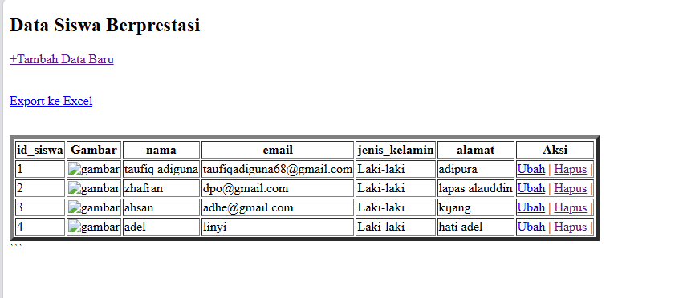
### Analisis
1. Kode program ini merupakan halaman utama (index) untuk menampilkan data siswa berprestasi yang disimpan dalam database.
2. Halaman ini terdiri dari beberapa elemen, yaitu:
    - Judul "Data Siswa Berprestasi"
    - Link "Tambah Data Baru" yang mengarah ke halaman "tambah.php"
    - Link "Export ke Excel" yang mengarah ke halaman "export.php"
    - Tabel yang menampilkan data siswa, meliputi: id_siswa, gambar, nama, email, jenis kelamin, dan alamat.
    - Tabel juga menampilkan aksi yang dapat dilakukan, yaitu "Ubah" dan "Hapus".
3. Data siswa ditampilkan dengan menggunakan perulangan `while` yang mengambil data dari tabel "siswa" di database.
4. Pada setiap baris data siswa, terdapat gambar, nama, email, jenis kelamin, dan alamat yang diambil dari tabel "siswa".
5. Tombol "Ubah" dan "Hapus" pada setiap baris data siswa akan mengarahkan pengguna ke halaman "ubah.php" dan "hapus.php" dengan membawa parameter ID siswa.
### Kesimpulan
Kode program ini merupakan halaman utama (index) untuk menampilkan data siswa berprestasi yang disimpan dalam database. Halaman ini memiliki fitur untuk menambah data baru, mengekspor data ke Excel, dan melakukan aksi ubah atau hapus data siswa. Keseluruhan fungsi pada halaman ini berjalan dengan baik dan dapat digunakan untuk manajemen data siswa.
## Download
### Program
```php
<?php

include "koneksi.php";

  

$query = mysqli_query($koneksi, 'SELECT * FROM siswa');

  

$data = [];

$data[] = ["ID", "Nama", "Email", "Jenis Kelamin", "Alamat"];

  

while ($row = mysqli_fetch_assoc($query)) {

    $data[] = [

        $row['id_siswa'],

        $row['nama'],

        $row['email'],

        $row['jenis_kelamin'],

        $row['alamat']

    ];

}

  

$namafile = "excel_data.xls";

header("Content-Type: application/vnd.ms-excel");

header("Content-Disposition: attachment;filename=\"$namafile\"");

header("Cache-Control: max-age=0");

  

$output = fopen("php://output", "w");

  

foreach ($data as $row) {

    fputcsv($output, $row, "\t");

}

  

fclose($output);

exit;
```
### Hasil

### Analisis
1. Kode program ini merupakan halaman untuk mengekspor data siswa ke dalam format file Excel (.xls). 
2. Pertama, program menyertakan file "koneksi.php" yang diduga berisi konfigurasi untuk koneksi ke database. 
3. Program kemudian mengambil semua data dari tabel "siswa" menggunakan perintah `mysqli_query()`.
4. Data yang diambil disimpan dalam sebuah array `$data`, di mana baris pertama berisi nama-nama kolom (ID, Nama, Email, Jenis Kelamin, Alamat).
5. Program selanjutnya mengatur header HTTP untuk memaksa browser mengunduh file Excel, dengan nama file "excel_data.xls".
6. Selanjutnya, program membuka output stream untuk menulis data ke file Excel menggunakan `fopen()` dan `fputcsv()`.
7. Setiap baris data dari array `$data` ditulis ke output stream menggunakan `fputcsv()`, dengan karakter tab sebagai pemisah antar kolom.
8. Setelah semua data ditulis, program menutup output stream dan keluar.

### Kesimpulan
Kode program ini berfungsi untuk mengekspor data siswa dari database ke dalam format file Excel (.xls). Hal ini dapat memudahkan pengguna untuk mengakses dan mengolah data siswa dalam bentuk spreadsheet. Sebagai seorang siswa SMK jurusan RPL, Anda dapat mempelajari bagaimana membuat fitur ekspor data ke Excel dengan menggunakan PHP dan MySQL. Selain itu, Anda juga dapat mempelajari tentang pengaturan header HTTP dan penggunaan fungsi-fungsi PHP untuk bekerja dengan file Excel.